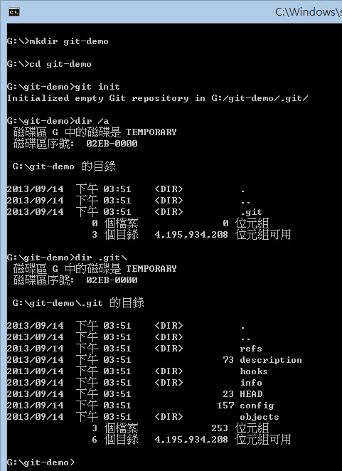
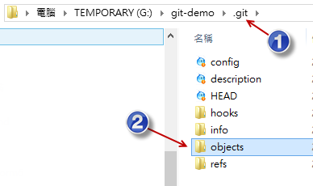

第 05 天：了解仓库、工作目录、物件与索引之间的关系
===============================================================

在使用 Git 版本控制的过程中，有些很基本的观念必须被建立，这样才能更有效率也更有意义的学下去。有清楚且正确的观念支持，不但有助于你学习 Git 指令操作，更重要的是，学习 Git 相关知识也会更加上手。

了解仓库
---------

我们要使用 Git 进行版本控制，很自然的，我们需要一个「版本库」来储存这些版本信息，而英文的 Repository 就是这个意思，笔者习惯将这个英文翻译成「仓库」，代表用来储存所有版本的一个空间或一个资料夹与一堆文件。

如果有 Git 使用经验的人，应该很清楚，建立仓库有很多方法，如果你要在任意一个资料夹建立一个 Git 仓库，只要输入以下指令就可以建立完成：

    git init

我们通过下图建立 Git 仓库的过程来说明，通过这张图我们可以很清楚的知道，当我们在 G:\git-demo 目录下执行 git init 之后，Git 会自动帮我们建立一个所谓的 Git repository 在该目录的 .git 目录下，各位不用怀疑，这个 .git 资料夹，就是一个完整的 Git 仓库，未来所有版本的变更，都会自动储存在这个资料夹里面。

了解工作目录
-----------

在上述这个例子里，目录 G:\git-demo 此时就会自动成为我们的「工作目录」 (working directory)。所谓「工作目录」的意思，就是我们正在准备开发的项目文件，未来都会在这个目录下进行编辑，无论是新增文件、修改文件、删除文件、文件更名、...以及所有其他 Git 相关的操作，都会在这个目录下完成，所以才称为「工作目录」。

我们在操作 Git 相关指令参数的时候，也通常都是在「工作目录」下执行的。

由于在使用 Git 版本控制时，会遭遇到很多分支的状況，所以工作目录很有可能会在不同的分支之间进行切换，有些 git 指令在执行的时候，会一并更新工作目录下的文件。例如当你使用 git checkout 切换到不同分支时，由于目前分支与想要切换过去的分支的目录结构不太一样，所以很有可能会将你目前工作目录下的文件进行更新，好让目前的工作目录下的这些目录与文件，都与另一个要切换过去的分支下的目录与文件一样。

所以，适时的保持工作目录的干净，是版本控制过程中的一个基本原则，更尤其是日后要进行合并的时候，这点尤其重要，相关知识我会在日后的文章中进一步说明。

了解 Git 的资料结构
-----------------

在 Git 里有两个重要的资料结构，分別是「物件」与「索引」。

「物件」用来保存版本库中所有文件与版本记录，「索引」则是用来保存当下要进版本库之前的目录状态。

关于物件
-------

所谓的「物件」是一个「特别的文件」，该文件的产生过程很有趣，是将一个文件的内容中取出，通过内容产生一组 SHA1 哈希值，然后依照这个 SHA1 哈希值命名的一个文件。

在使用 Git 进行版本控制的过程中，所有要进行控制的目录与文件，都会先区分「目录信息」与「文件内容」，我们称为 tree 物件与 blob 物件。

其中 blob 物件就是把原本的「文件内容」当成 blob 文件的内容 (注意: blob 物件其实就是一个实体文件)，然后再将其内容进行 SHA1 哈希运算后产生的一个 hash id，再把这个 hash id 当成 blob 文件的档名。由此可知，blob 物件是一个「只有内容」的文件，其档名又是由内容产生的，所以，任何一个单独存在的 blob 文件通常对版本控制没有任何帮助。

另一个 tree 物件，则是用来储存特定资料夹下包含哪些文件，以及该文件对应的 blob 物件的档名为何。在 tree 物件中，除了可以包含 blob 物件的档名与相关信息，还可以包含其他的 tree 物件。所以 tree 物件其实就是「资料夹」的代名词。

无论 blob 物件与 tree 物件，这些都算是物件，这些物件都会储存在一个所谓的「物件储存区」 (object storage) 之中，而这个「物件储存区」预设就在「仓库」的 objects 目录下，如下图示：

详细的物件结构，我们会在接下来的文章谈到。

关于索引
-------

所谓的「索引」是一个经常异动的暂存档，这个文件通常位于 .git 目录下的一位名为 index 的文件。简单来说，「索引」的目的主要用来记录「有哪些文件即将要被提交到下一个 commit 版本中」。换句话说，如果你想要提交一个版本到 Git 仓库，那么你一定要先更新索引状态，变更才会被提交出去。

这个索引档，通常保存着 Git 仓库中特定版本的状态，这个状态可以由任意一个 commit 物件，以及 tree 物件所表示。

我们通常不会直接去编辑 .git\index 这个二进位档，而是通过标准的 git 指令去操作这个索引档，对于索引档的操作指令大概有以下几个：

* git add
* git mv
* git rm
* git status
* git commit
* git ls-files

Git 的「索引」是一个介于「物件储存区」 (object storage) 与「工作目录」 (working directory) 之间的媒介。

各位也许已经可以猜到，本篇文章想阐述的这几个观念之间的关系，可以用以下 5 个步骤解释：

* 要使用 Git 版本控制，你必须先建立「工作目录」与「版本库」。(mkdir, git init)
* 你要先在「工作目录」进行开发，你可能会建立目录、建立文件、修改文件、删除文件、... 等操作。
* 然后当你想提交一个新版本到 Git 的「仓库」里，一定要先更新「索引」状态。(git add, git mv, ...)
* 然后 Git 会依据「索引」当下的状态，决定要把那些文件提交到 Git 的「仓库」里。(git status)
* 最后提交变更时 (git commit)，才会把版本信息写入到「物件储存区」当中 (此时将会写入 commit 物件)。

详细的索引结构与指令操作，我们会在接下来的文章谈到。

    注: 由于 tree 的概念跟 directory 很像，所以在看国外原文时，working directory 也经常被写成 working tree！

今日小结
-------

今天探讨的 Git 架构，最重要的还是在「物件」与「索引」之间的关系，因为没有「索引」信息，Git 就无法建立版本。

而基于「物件」与「索引」的差异，你应该可以发现，「物件」是属于一种「不可变的」 (immutable) 文件类型，任何写入到「物件储存区」的物件，原则上都不会再发生异动，因为所有的物件都是从原本的文件内容产生的。我们也可以说这是一个「物件资料库」 (object database)，且这个资料库通常只会增加内容，比较不会有「删除内容」或「异动内容」的情況，只有在执行 git gc 清除垃圾资料时才会删除资料。「索引」则是属于一种「可变的」 (mutable) 索引档，用来记录目前工作目录准备要 commit 的内容。

当你一步一步的接近 Git 核心，慢慢地将模糊不清的抽象概念，转变成具象的观念知识，你就不会再对 Git 感到不安，请继续努力学习，成功就在前方。

参考连结
-------

* [Git Internals - Git Objects](https://git-scm.com/book/en/Git-Internals-Git-Objects)
* [Pro Git Book](https://progit.org/)
* [Git Magic - 繁体中文版](https://www-cs-students.stanford.edu/~blynn/gitmagic/intl/zh_tw/)
* [Git (software) - Wikipedia, the free encyclopedia](https://en.wikipedia.org/wiki/Git_(software) "Git (software) - Wikipedia, the free encyclopedia")

-------
* [回目录](README.md)
* [前一天：常用的 Git 版本控制指令](04.md)
* [下一天：解析 Git 资料结构 - 物件结构](06.md)

-------

