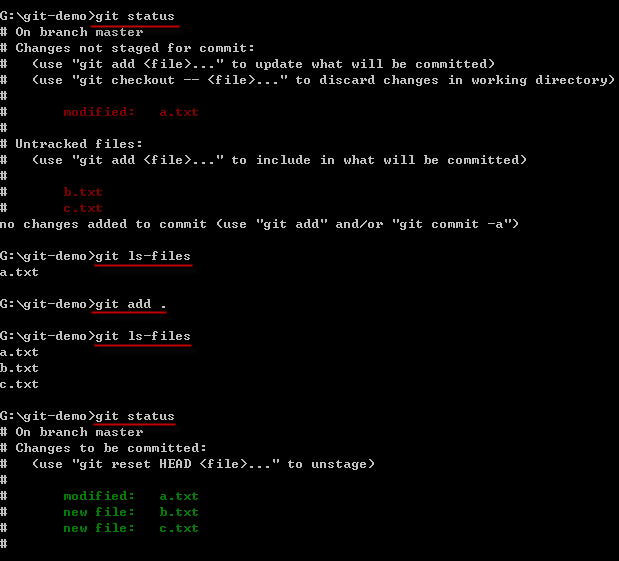

# 第 07 天：解析 Git 资料结构 - 索引结构

我们知道在 Git 里两个重要的资料结构，分別是「物件」与「索引」，这篇文章主要用来解说「索引」的细节。使用 Git 版本控制的过程中，或许你可以很轻易的了解 git 指令的用法，不过那很容易流于死记，无法灵活运用，连 Linus Torvalds 都在邮件清单 (Mailing List) 中提到：「在使用者了解索引的意义之前，是无法完整了解 Git 的能力的」，因此，了解「索引」的用途十分重要。

## 关于索引

简单来说，「索引」的目的主要用来记录「有哪些文件即将要被提交到下一个 commit 版本中」。

换句话说，「如果你想要提交一个版本到 Git 仓库，那么你一定要先更新索引状态，变更才会被提交出去。」

这里的「索引」其实在国外很多文章里曾经出现过很多別名，但其意思都是相同的，各位以后看到相关单字千万不要被混淆了。

* Index (索引)
* Cache (快照)
* Directory cache (目录快照)
* Current directory cache (当前目录快照)
* Staging area (等待被 commit 的地方)
* Staged files (等待被 commit 的文件)

举个例子来说，指令 `git diff --cached` 就与 `git diff --staged` 是完全同义的。

## 操作索引的指令

由于「索引」对 Git 来说十分重要，在大多数的指令中都会有跟 Git 索引相关的参数可用，不过我们大致列出几个直接与「索引」相关的指令来解说。

在解说指令之前，各位可以先看看以下示意图，这说明了通过指令改变状态的生命周期，事实上，这些改变的过程，都是在更新「索引档」的过程：


首先，先介绍四种文件状态：

* untracked (未追踪的，代表尚未被加入 Git 仓库的文件状态)
* unmodified (未修改的，代表文件第一次被加入，或是文件内容与 HEAD 内容一致的状态)
* modified (已修改的，代表文件已经被编辑过，或是文件内容与 HEAD 内容不一致的状态)
* staged (等待被 commit 的，代表下次执行 git commit 会将这些文件全部送入版本库)

### git status

取得 **工作目录** (working tree) 下的状态。

由于先前已经讲过仓库、工作目录、物件与索引之间的关系，我们用一句话说明这关系：

```txt
Git 仓库的运作，是将工作目录里的变化，通过更新索引的方式，将资料写入成 Git 物件。
```

这里的 `git status` 指令，目的是显示出 **目前最新版** 与 **索引档** 之间的差异，这当中的差异包含了一些微妙的关系，我们用一个例子来解释这层关系。

以下是执行 git status 的结果：

```sh
G:\git-demo>git status
# On branch master
# Changes to be committed:
#   (use "git reset HEAD <file>..." to unstage)
#
#       new file:   c.txt
#
# Changes not staged for commit:
#   (use "git add <file>..." to update what will be committed)
#   (use "git checkout -- <file>..." to discard changes in working directory)
#
#       modified:   a.txt
#
# Untracked files:
#   (use "git add <file>..." to include in what will be committed)
#
#       b.txt
```

这里你会看到有三种不同的分组，分別是：

* Changes to be committed (准备提交的变更)
  * 这区有个 `new file: c.txt` 文件，代表 c.txt 是一个新文件，而且已经被标示可提交。
  * 这代表着几件事：
    1. **目前最新版** 并没有 c.txt 这个文件
    2. **索引档** 已经加入了这个 c.txt 文件
    3. 所以该文件会在执行 git commit 之后被存入下一个版本
* Changes not staged for commit (尚未准备提交的变更)
  * 这区有个 `modified: a.txt` 文件，代表 a.txt 已经被变更，但尚未标示可提交。 (not staged)
  * 这代表着几件事：
    1. **目前最新版** 也有 a.txt 这个文件
    2. **索引档** 尚未加入 a.txt 这个文件
    3. 所以该文件就算执行了 git commit 也不会在下一版中出现
* Untracked files (未追踪的变更)
  * 这区有个 `b.txt` 文件，代表 b.txt 尚未被追踪。(untracked)
  * 这代表着几件事：
    1. **目前最新版** 没有 b.txt 这个文件
    2. **索引档** 也没有 b.txt 这个文件
    3. 所以该文件就算执行了 git commit 也不会在下一版中出现

所以你可以看到，执行 git status 就是为了查出 **目前最新版** 与 **索引档** 之间的差异，最终只有 **目前最新版** 与 **索引档** 之间有差异的变更，才会真正储存到下一个 commit 物件里。

### git add

`git add` 指令，是为了将目前「工作目录」的变更写入到「索引档」里。

使用 `git add -u` 则可以仅将「更新」或「删除」的文件变更写入到「索引档」中。

### git rm

我们以 `git rm` 为例，当你直接在文件系统中删除一个文件，这只是从「工作目录」中删除而已，并没有更新到索引档，你可以利用 git status 看到这层改变，不过若要真正把「删除」的状态写进索引档的话，则要靠 `git rm filename` 更新索引档。

在执行 `git rm filename` 的时候，除了更新索引档之外，连工作目录下的文件也会一并被删除。若你只想删除索引档中的该档，又要保留工作目录下的实体文件，那么你可以在指令列加上 `--cached` 参数，就能做到，例如：

```sh
git rm --cached a.txt
```

### git mv

使用 `git mv oldname newname` 可以将文件更名，执行此命令会同时更新索引与变更工作目录下的实体文件。

### git commit

这个指令，则是把「索引档」与「目前最新版」中的资料比对出差异，然后把差异部分提交变更成一个 commit 物件。

### git ls-files

在索引档之中，预设就包含了 **目前最新版** 的所有文件，外加你在工作目录中新增文件且通过 `git add` 更新索引档后的那些文件。通过 `git ls-files` 命令，可以列出所有目前已经储存在「索引档」中的那些文件路径。

从下图范例，你应该可以看出这几个指令之间的关系：



## 今日小结

Git 里的「索引」是 Git 版控中最重要的观念，有了这层观念，也自然能得知，为什么每次提交变更都要打一些指令把变更给加进去。当然，也有许多好用的 GUI 工具可以帮你少打许多指令，不过在我们正式开始使用 Git 的 GUI 工具之前，我们还是多靠指令把观念给建立再说吧！

## 参考连结

* [Git - Recording Changes to the Repository](https://git-scm.com/book/en/Git-Basics-Recording-Changes-to-the-Repository)
* [Pro Git Book](https://progit.org/)
* [Git Magic - 繁体中文版](https://www-cs-students.stanford.edu/~blynn/gitmagic/intl/zh_tw/)
* [Git (software) - Wikipedia, the free encyclopedia](https://en.wikipedia.org/wiki/Git_(software) "Git (software) - Wikipedia, the free encyclopedia")

---

* [回目录](README.md)
* [前一天：解析 Git 资料结构 - 物件结构](06.md)
* [下一天：关于分支的基本观念与使用方式](08.md)

---
