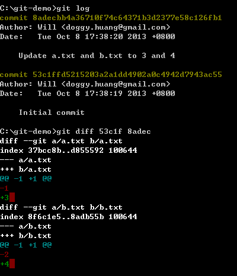

第 09 天：比对文件与版本差异
===========================================

使用任何版本控制软件的过程中，经常会需要查看历史记录与比对版本之间的差异。而在使用 Git 的时候要如何进行比对，将是本文重点。

准备工作目录
-----------

我们通过以下指令快速建立一个拥有两个文件与两个版本变更记录的 Git 仓库与工作目录：

	mkdir git-demo
	cd git-demo
	git init

	echo 1 > a.txt
	echo 2 > b.txt
	git add .
	git commit -m "Initial commit"

	echo 3 > a.txt
	echo 4 > b.txt
	git add .
	git commit -m "Update a.txt and b.txt to 3 and 4"

关于 git diff 的基本观念
------------------------

在 Git 中比对两个版本之间的差异，通常会用 `git diff` 命令，我们先执行一个简单的命令，比对两个版本之间的差异：

1. 先执行 `git log` 取得版本信息，并取得最近两个 commit 物件的 id
2. 我们在执行 `git diff commit1 commit2` 指令，比对两个版本间的差异，其中 commit1 请用较旧的版本，而 commit2 则用较新的版本。

如下图示：

我们从 `git diff` 执行的输出结果，将可得到一个执行的结果。由于我们这两个版本库中有两个文件，而且在这两个版本之间也都有异动，所以他会列出两段「差异比对」的结果。

各位可以从上图看到每一段都是以 `diff --git` 开头，代表 git 对哪两个文件进行比对。

第二行的 `index 37bcc8b..d855592 100644` 则是代表 git 在做这次比对时的｢标头信息｣(Header Line)，这里可能会有好几行，信息不一定只有这些。这里会标示许多关于此次差异比对的额外信息。例如 index 这行，后面的两个 hash id (`37bcc8b..d855592`) 就代表在 Git 物件仓库(object storage)中的两个 blob 物件 id，用来比较这两个 blob 物件。在后面的 `100644` 则是 git 属性，有点类似 Linux 环境下的文件属性，例如宣告这是个文件、目录、可读、可写、可执行之类的。以下是几个常见的 git 属性范例：

	0100000000000000 (040000): Directory
	1000000110100100 (100644): Regular non-executable file
	1000000110110100 (100664): Regular non-executable group-writeable file
	1000000111101101 (100755): Regular executable file
	1010000000000000 (120000): Symbolic link
	1110000000000000 (160000): Gitlink

相关连结可参考以下讨论串：

* [How to read the mode field of git-ls-tree's output](https://stackoverflow.com/questions/737673/how-to-read-the-mode-field-of-git-ls-trees-output)
* [index-format.txt](https://github.com/gitster/git/blob/master/Documentation/technical/index-format.txt)

接下来第三行的 `--- a/a.txt` 则代表两个比对的版本中「比较旧的」那个版本。

接下来第四行的 `+++ b/a.txt` 则代表两个比对的版本中「比较新的」那个版本。

接下来第五行的 `@@ -1 +1 @@` 则代表这个文件在旧版的总行数与新版的总行数，-1 代表旧版只有 1 行，+1 代表新版也只有 1 行。

最后则是列出所有变更的内容，这里有三种可能的表示法：

* 以減号 - 号开头，代表从旧版到新版的过程中，此行被删除了。
* 以加号 + 号开头，代表从旧版到新版的过程中，此行是被新增上去的。
* 以空白字元开头，则代表这一行在两个版本中都有出现，没有任何变更。

如此一来就完成了这两个版本中第一个 blob 物件的差异比对，接着会显示该版本中第二个 blob 物件的差异比对，以此类推。

在 Git 中使用 `git diff` 的时候，事实上是以 tree 物件为比较的单位，我们从【第 06 天：解析 Git 资料结构 - 物件结构】文章图解与影片中有学到，其实每一个 commit 物件都会包括一个根目录的 tree 物件。所以我们刚刚利用 `git diff` 比对两个 commit 物件时，其实比对的是 commit 物件下的那个 tree 物件，而比对的过程又会递归的一直比下去。由此你应该可以感受到，Git 的 diff 比对机制十分强大，你可以很快速的比对出任意两个版本之间的异动比较。

在使用 `git diff` 命令时，主要有三种 tree 物件的来源，分別是：

* 在所有的 commit graph 中存在的 tree object，也就是任意版本中任意一个 tree 物件的意思。
* 索引 (index)，代表你已经将文件状态送进「索引资料库」的那些信息，此时通过 `git add` 命令时，其实 tree 物件已经被建立。
* 你目前的工作目录 (working directory)，虽然工作目录的改变还没有变成 tree 物件，但通过 `git diff` 是可以这样用的。

四种基本的比较方式
-----------------

要通过 `git diff` 命令比对任意两个版本，通常会有以下四种指令的用法：

1. git diff

	在什么参数都不加的使用情況，比对的是「工作目录」与「索引」之间的差异。这是个很常用的指令，因为当你执行 `git add .` 指令之前，先通过 `git diff` 查看你自己到底改了哪些东西。

	**注**：事实上，在使用 Git 版本控制的过程中，在执行 `git commit` 之前，的确有可能会执行 `git add` 指令好几次，用以确认到底哪些文件要加入到索引之中，最后才会 commit 进版本。

2. git diff commit

	如果你只在 `git diff` 之后加上一个 commit id，比对的是「工作目录」与「指定 commit 物件里的那个 tree 物件」。

	最常用的指令是 `git diff HEAD`，因为这代表你要拿「工作目录」与「当前分支的最新版」进行比对。这种比对方法，不会去比对「索引」的状态，所以各位必须区分清楚，你到底比对的是什么 tree 物件的来源。

3. git diff --cached commit

	在执行 `git commit` 之前，索引状态应该已经都准备好了。所以如果你要比对「当前的索引状态」与「指定 commit 物件里的那个 tree 物件」，就可以用这个指令完成比对任务。

	最常用的指令一样是 `git diff --cached HEAD`，这个语法代表的是「当前的索引状态」与「当前分支的最新版」进行比对。这种比对方法，不会去比对「工作目录」的文件内容，而是直接去比对「索引」与「目前最新版」之间的差异，这有助于你在执行 `git commit` 之前找出那些变更的内容，也就是你将会有哪些变更被建立版本的意思。

	**注1**: `git diff --cached` 与 `git diff --staged` 是完全一样的结果，`--staged` 只是 `--cached` 的別名，让你比较好记而已!

	**注2**: `git diff --cached` 与 `git diff --cached HEAD` 执行时也是完全一样的结果，最后的 HEAD 可以省略。

4. git diff commit1 commit2

	最后一种则是通过两个不同的版本 ( commit id ) 来比对其差异，这个命令可以跳过「索引」与「工作目录」的任何变更，而是直接比对特定两个版本。事实上 Git 是比对特定两个版本 commit 物件内的那个 tree 物件。

	最常用的指令则是 `git diff HEAD^ HEAD` 命令，这代表你要比较【最新版的前一版】与【最新版】之间的差异。这里的 HEAD 与 ^ 的意义，我们会在日后的文章中说明。

今日小结
-------

今天介绍的 `git diff` 是个很常用的指令，各位应该熟练地使用它。我们最后来复习一下其常用指令的差异：

    git diff                 => 工作目录 vs 索引
    git diff HEAD            => 工作目录 vs HEAD
	git diff --cached HEAD   => 索引     vs HEAD
    git diff --cached        => 索引     vs HEAD
	git diff HEAD^ HEAD	     => HEAD^   vs HEAD

我重新整理一下本日学到的 Git 指令与参数：

* git log
* git diff
* git diff HEAD
* git diff --cached
* git diff --staged
* git diff HEAD^ HEAD

参考连结
-------

* [BASIC SNAPSHOTTING](https://gitref.org/basic/#diff)
* [git-diff(1) Manual Page](https://www.kernel.org/pub/software/scm/git/docs/git-diff.html)

-------
* [回目录](README.md)
* [前一天：关于分支的基本观念与使用方式](08.md)
* [下一天：认识 Git 物件的绝对名称](10.md)

-------

