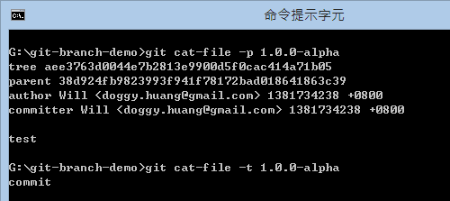
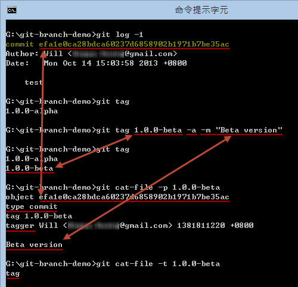

第 15 天：标签 - 标记版本控制过程中的重要事件
===========================================================

在使用 Git 版本控制的过程中，会产生大量的版本，随着寒暑易节、物换星移，在这众多的版本之中，一定会有一些值得我们记录的几个重要版本，这就是｢标签｣ (Tag) 能帮我们做的事。

关于标签 (Tag) 的基本概念
------------------------

基本上，标签的用途就是用来标记某一个「版本」或称为「commit 物件」，以一个「好记的名称」来帮助我们记忆【某个】版本。

Git 标签 (Tag) 拥有两种型态，这两种类型分別是：

* 轻量标签 (lightweight tag)
* 标示标签 (annotated tag)

我们在【第 11 天：认识 Git 物件的一般参照与符号参照】文章中有提到「一般参照」包含了「标签名称」这项，这里的「标签名称」就是所谓的「轻量标签」(lightweight tag) 。所以「轻量标签」可以说是某个 commit 版本的「別名」而已，是一种「相对名称」。

「标示标签」(annotated tag)则是一种 Git 物件，就像我们在【第 06 天：解析 Git 资料结构 - 物件结构】提到的，Git 物件包含 4 种物件类型，分別是 Blob, Tree, Commit 与 Tag 物件，这里讲的「标示标签」就是 Tag 物件。Tag 物件会储存在 Git 的物件储存区当中 ( 会存到 `.git\objects\` 目录下 )，并且会关联到另一个 commit 物件，建立「标示标签」时还能像建立 commit 物件时一样包含「版本消息」。在内建的 Git 标签机制中，什至你还可以利用 [GnuPG](https://gnupg.org/) 金钥对 Tag 物件加以签章，以确保消息的「不可否认性」。

虽然我们有这两种标签类型，看起来也都像某个 commit 物件的「別名」，但这两种标签在使用上只有些微的差异而已。在大部分的使用情境下，我们都会用「标示标签」来建立「标签物件」并且给予「版本消息」，因为这种「标签」才是 Git 仓库中「永久的物件」。( 储存到物件仓库中的 Git 物件都是不变的，只有索引才是变动的 )

了解轻量标签(lightweight tag)的使用方式
---------------------------------------

我用一个简单的例子说明建立「轻量标签」的过程，如下图示：(请自行看图说故事)

**提示**：所有在 `.git\refs\` 下的文件都是个「参考名称」。

大致的使用说明如下：

* 列出所有标签：`git tag`
* 建立轻量标签：`git tag [tagname]`
* 删除轻量标签：`git tag [tagname] -d`

如果我们想看这个「轻量标签」的内容，我们可以通过 `git cat-file -p [tagname]` 取得。如果我们想看这个「轻量标签」的物件类型，可以通过 `git cat-file -t [tagname]` 取得。如下图示：

**请注意**: 轻量标签不是个 Git 物件，所以我们从上图可以看出，该 Tag 名称取得的是 commit 物件的内容，而且该名称所查出的物件类型是 commit 物件。

了解标示标签(annotated tag)的使用方式
------------------------------------

我也用一个简单的例子说明建立「标示标签」的过程，如下图示：(请自行看图说故事)

这里跟「轻量标签」有些不一样的地方：

1. 当我们执行 `git tag` 列出所有标签时，所有标签都会混在一起，看不出标签的类型。
2. 建立「标示标签」要加上 `-a` 参数。
3. 建立「标示标签」一定要加上「版本消息」，跟执行 `git commit` 一样都有 `-m` 参数可用。
4. 当我们执行 `git cat-file -p 1.0.0-beta` 时，你应该可以看出这个物件内容跟 commit 物件稍稍有点不同。
5. 当我们执行 `git cat-file -p 1.0.0-beta` 时，你从内容看到的 `type` 讲的是上一行 `object` 的物件类型，这代表你也可以把任何 Git 物件建立成一个标签物件。
6. 当我们执行 `git cat-file -t 1.0.0-beta` 时，得到的是 tag 物件类型。

标示标签的指令用法，跟轻量标签一模一样，差別只有 `-a` 参数而已。（如果只有使用 `-m` 他会隐含着 `-a` 也帮你加上。）

※ 预设 `git tag [tagname] -a` 会将当前的 `HEAD` 版本建立成「标签物件」，如果要将其他特定物件建立为标签的用法为 `git tag [tagname] [object_id]`。

今日小结
-------

最后，我把本篇文章建立的两个例子重新比较一遍，从下图你应该可以很清楚看出两者之间的差异：

我重新整理一下本日学到的 Git 指令与参数：

* git tag
* git tag [tagname]
* git tag [tagname] -a
* git tag [tagname] -d

※ 若想查询 `git tag` 的完整用法，可在命令提示字元下执行 `git help tag` 即可显示完整的文件说明。

参考连结
-------

* [BRANCHING AND MERGING](https://gitref.org/branching/#tag)
* [Semantic Versioning](https://semver.org/)

-------
* [回目录](README.md)
* [前一天：Git for Windows 选项设定](14.md)
* [下一天：善用版本日志 git reflog 追踪变更轨迹](16.md)

-------

