第 17 天：关于合并的基本观念与使用方式
========================================================

我曾在【第 08 天：关于分支的基本观念与使用方式】提过关于「分支」的基本观念与用法，现在则要来讲「合并」如何进行。由于 Git 是一种分布式版本控制系统(DVCS)，过程中会不断的进行分支与合并，无论是有意的合并(`git merge`)或无意的合并(`git pull`)，总之使用 Git 版控「分支」与「合并」的动作确实经常发生。本篇文章将说明「合并」动作的基本观念与使用方式。

关于「合并」的基本观念
--------------------

当你在 Git 工作目录下建立分支时，可以让你的系统依据不同的需求分別进行开发，又不互相影响。例如你原本稳定的系统可以放在 `master` 分支中进行开发，而当要修正错误时则额外建立一个 `bugfix` 分支来改正软件错误，等 Bugs 修正后，再通过「合并」的方式将 `bugfix` 分支上的变更重新套用到 `master` 上面，这就是一种主要的使用情境。

一般来说，大家都是以一个主要或预设分支进行开发(`master`)，然后再依据需求建立分支(`bugfix`)，最后则是将两个分支合并成一个。事实上，执行「合并」动作时，是将另一个分支合并回目前分支，然后再手动将另一个分支给移除，这样才符合「两个分支合并成一个」的概念。

实际上，也经常有机会将三个、四个或更多的分支合并到其中一个分支。例如你除了主要分支(`master`)外，还额外建立了除错用的分支(`bugfix`)与新增功能(`feature`)的分支，当开发到一定程度后，你可以决定要不要将这个两个分支一起合并回主要分支(`master`)。

在 Git 使用合并时，有一个重要的观念是【合并的动作必须发生在同一个仓库中】。请回想一下，在任何一个 Git 仓库中，都必须存在一个 Initial Commit 物件(初始版本)，而所有其他版本都会跟这个版本有关系，这个关系我们称为「在分支线上的可追踪物件」(the tracked object on the branch heads)，所以你不能将一个仓库的特定分支合并到另一个毫不相干的仓库的某个分支里。

合并的时候，如果两个分支当中有修改到相同的文件，但只要修改的行数不一样，Git 就会自动帮你套用/合并这两个变更。但如果就这么刚好，你在两个分支里面改到「同一个文件」的「同一行」，那么在合并的时候就会引发冲突事件。当合并冲突发生时，Git 并不会帮你决定任何事情，而是将「解决冲突」的工作交给「你」来负责，且这些发生冲突的文件也都会被标示为 `unmerged` 状态，合并冲突后你可以用 `git status` 指令看到这些状态。

体验一场「成功的合并」
--------------------

简单来说，「成功的合并」就是没有发生「冲突」的合并。我们用一个简单的例子说明合并的过程与指令的用法：

	mkdir git-merge-demo
	cd git-merge-demo
	git init

	echo. > a.txt
	git add .
	git commit -m "Initial commit (a.txt created)"

	echo 1 > a.txt
	git add .
	git commit -m "Update a.txt!"

执行结果如下图示，我们建立了两个版本，而且最新版的 `a.txt` 内容为 `1`：

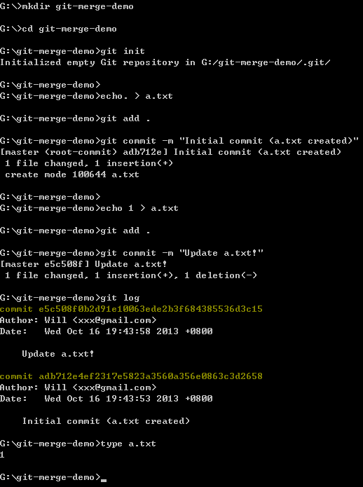

接着我们通过 `git checkout -b feature` 建立一个 `feature` 分支，并同时把工作目录给切换到 `feature` 分支进行开发，然后建立一个内容为 `2` 的 `b.txt` 文件：

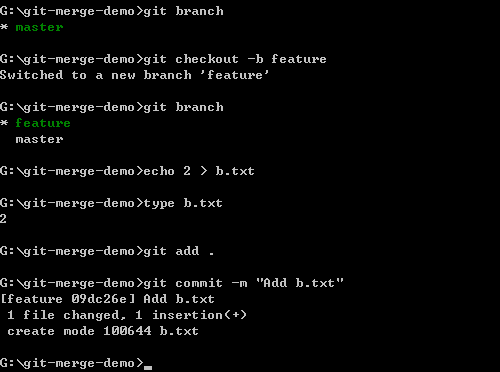

**注意**：在切换「分支」之前，请随时查看并保持「工作目录」的状态是「干净的」，不要有任何文件异动中的状态。

现在我们回顾一下两个分支的内容：

* 主要分支：`master`
	* 拥有 `a.txt` 其内容为 `1`
* 功能分支：`feature` (目前所在分支)
	* 拥有 `a.txt` 其内容为 `1`	(此文件是从 `master` 分支继承过来的)
	* 拥有 `b.txt` 其内容为 `2`

我们现在要做 3 件事：

1. 将工作目录切换回 `master` 主要分支
2. 将 `a.txt` 的内容新增一行 `NEW LINE` 在第二行 (第一行不动)
3. 将 `a.txt` 的异动加入索引，并 commit 版本

如下图示：

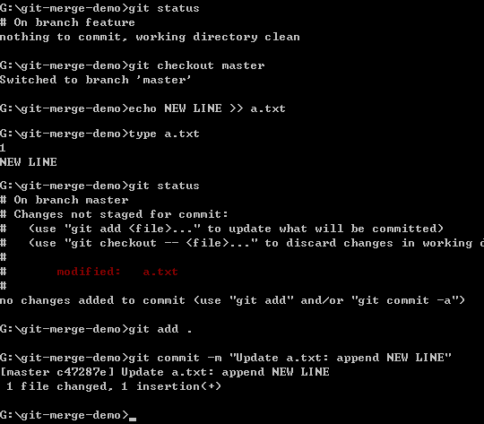

现在我们再回顾一次当下两个分支的内容：

* 主要分支：`master` (目前所在分支)
	* 拥有 `a.txt` 其内容有两行，第一行为 `1`，第二行是 `NEW LINE`
	* 这里没有 `feature` 分支的变更，也就是没有 `b.txt` 文件。
* 功能分支：`feature`
	* 拥有 `a.txt` 其内容为 `1`	(这是从 `master` 分支继承过来的，在 `feature` 没动过)
	* 拥有 `b.txt` 其内容为 `2`	(这是从 `feature` 才新建立的文件)

我们用 SourceTree 可以查看较为漂亮的 commit graph (版本图)：

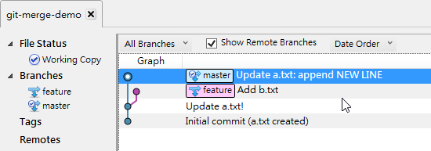

由于两个分支都有在建立 `feature` 分支后都做过异动，不过你可能会发现到，这两个分支当中，从「分支点」开始，所做的修改并没有互相冲突，只要是这种状況，合并并不会发生问题。接下来我们就来执行「合并」动作 (`git merge`)。

从下图示中，有许多我想强调的细节：

1. 合并之前，先看清楚自己在哪个分支
2. 合并之前，请确保工作目录是干净的
3. 合并时请用 `git merge [另一个分支]` 来将另一个分支的变更合并回来
4. 你可以从下图看到我打错字了，但 Git 还会自动帮我执行正确的指令，详情请见【第 14 天： Git for Windows 选项设定】
5. 合并成功后，你可以利用 `git log` 查看版本记录，你可以发现**「合并」的过程会自动建立一个新版本**！

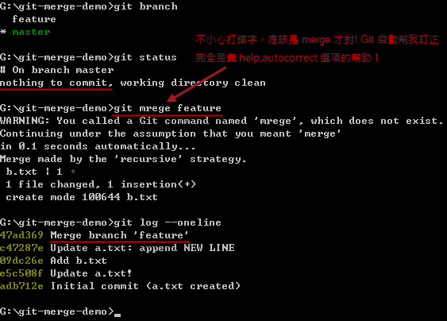

我们看看「合并后」的分支状況，用 SourceTree 的 commit graph 来看：

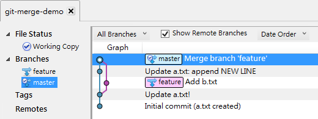

最后我们来看看合并后的文件内容，确实如我们预期的把两个分支中的变更都给合并了：

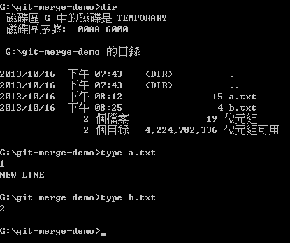

这就是一场成功的「合并」！ :-)

删除不必要的分支
----------------

假设我们 `feature` 分支还会持续开发新功能，所以可以暂时将它留着，让后续还能继续切换到 `feature` 分支继续开发。

如果你确定用不到的话，可以用 `git branch -d feature` 删除该分支。

在 Git 里，只要没有执行过「合并」的分支，都不能用上述指令进行删除，必须改用 `git branch -D feature` 才能删除该分支。

救回误删的分支
--------------

不过，如果你不小心「误删」该分支(`feature`)的话，则必须用以下步骤救回分支，稍微麻烦一点：

1. 先利用 `git reflog` 找出该分支(`feature`)最后一个版本的 object id (也就是 SHA1 格式的物件绝对名称)
2. 执行 `git branch feature <SHA1>` 即可

如下图示，最终还是能把误删的 `feature` 分支给救回：

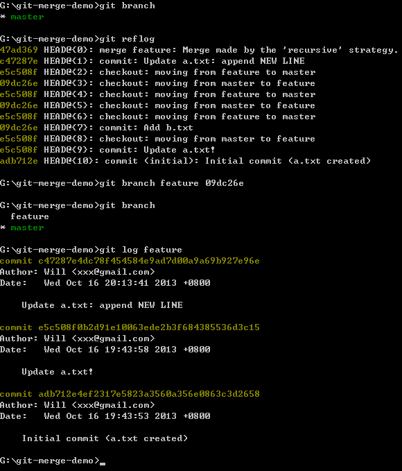

体验一场「冲突的合并」
--------------------

现在，我们从 `master` 分支的最新版(`HEAD`)建立一个 `hotfixes` 分支，执行指令：`git checkout -b hotfixes`

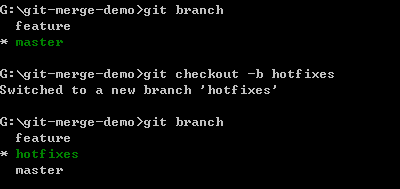

我们修改 `a.txt` 的第一行，把原本的 `1` 修改为 `bugfixed: 1`，并建立版本。然后切换回 `master` 分支：

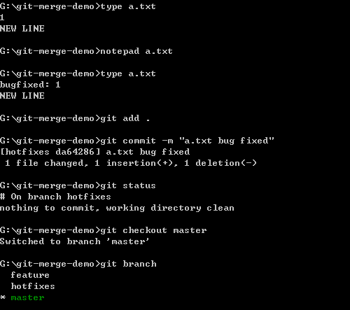

接着，我们在 `master` 分支修改 `a.txt` 的第一行，把原本的 `1` 修改为 `bugfixed by Will: 1`，并建立版本。

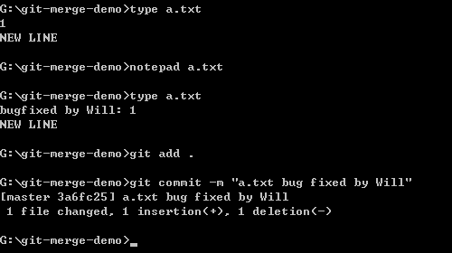

现在，我们两个分支都同时修改了 `a.txt` 的文件内容，而且都在同一行，这样的修改方式，勢必引发「冲突」。我们就马上来体验一下：

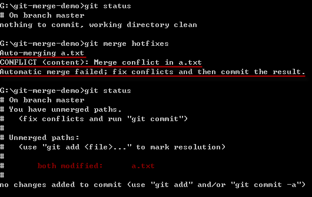

没错，真的冲突了，而且 Git 告诉我要自己修正(fix)这个冲突(conflicts)。我们用 `git status` 可以看出目前发生冲突的文件有哪些，而且你也可以看到这个文件位于 `Unmerged paths` 这个区段。

查看冲突的内容
--------------

当你发生冲突的时候，切莫慌张，先执行 `git diff` 自动比对出到底哪些文件的哪几行发生冲突了。

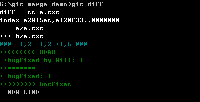

从上图你必须注意的是 `diff` 针对冲突内容的表示法，看的懂，你才容易知道怎样改：

* 从 `<<<<<<< HEAD` 到 `=======` 的内容，代表 `HEAD` 里 `a.txt` 的内容。**注**：`HEAD` 代表当前 `master` 分支的最新版。
* 从 `=======` 到 `>>>>>>> hotfixes` 的内容，代表 `hotfixes` 分支里 `a.txt` 的内容

解决冲突状态的方法
-----------------

我先来说说「解决冲突状态」的方法，其实很简单，直接输入 `git add .` 把目前工作目录的状态加入到「索引」之中，就可以取消这些 Unmerged 文件的冲突状态。

如果你很懶，遇到冲突什么都不改，直接执行 `git add .` 再加上 `git commit` 的话，确实会「解决冲突」，但所 commit 的版本将会包含这些冲突的表示文字，如果你身处一个开发团队，肯定会被骂翻到臭头，请你千万不要这么做！

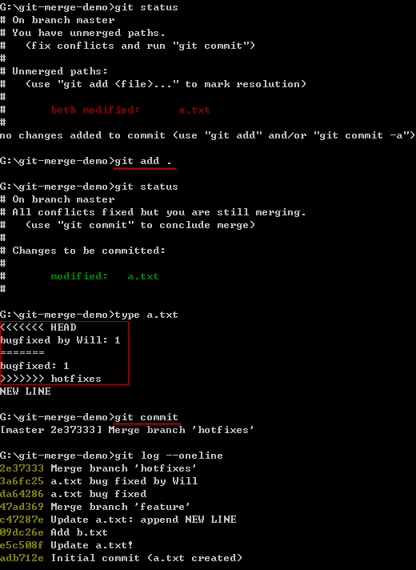

做错了？没关系，只要执行 `git reset --hard ORIG_HEAD` 就可以回复到上一版，然后再重新合并一次引发相同的冲突。

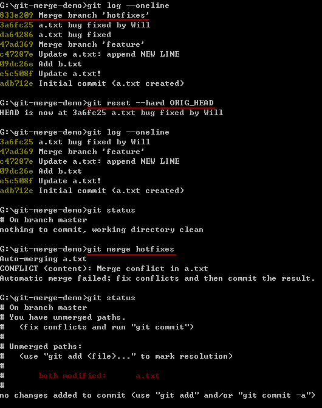

找出冲突的文件
--------------

当合并发生冲突时的文件数量很少时，或许直接打 `git diff` 可以看得出差异，但如果是两个比较大的分支发生冲突的话，很有可能会有一大堆文件有冲突的状況。这时你可能会想一个一个文件的来查看冲突的状況，这时你可以用以下两种 Git 指令找出冲突的文件：

* 执行 `git status`
* 执行 `git ls-files -u`

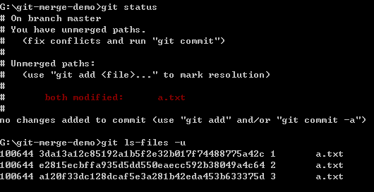

找到之后再用 `git diff [filepath]` 就可以仅比对其中一个文件了：

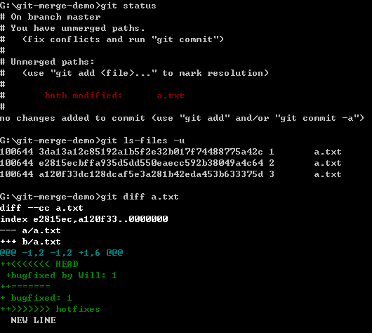

真正解决冲突
------------

真的要解决冲突，你必须手动把这些冲突的文件改好。不过，如果这时使用 SourceTree 来修复冲突的文件，那生命将会美好许多。

我们开启 SourceTree 并进入 Working Copy 节点，在文件清单中按下鼠标右键，这时有个 **Resolve Conflicts** (解决冲突) 的选单，这里你就能选择你要用我的(`Mine`)或是用其他人的(`Theirs`)来解决这个文件的冲突状态。所谓「我的」就是你当前工作目录的那个分支(`master`)，而「他的」就是被我们指定合并进来的那个分支(`hotfixes`)。

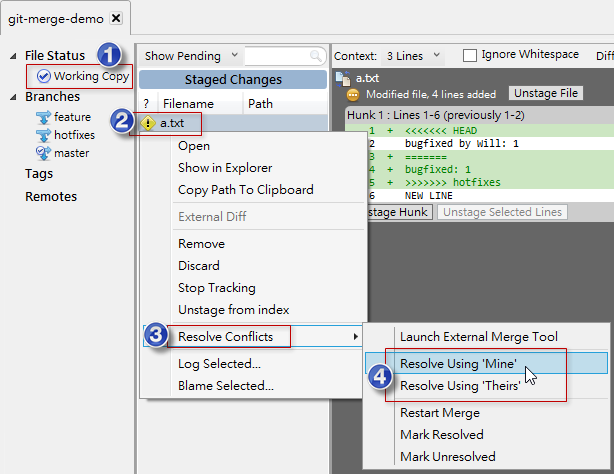

如果我选 **Resolve Using 'Mine'** 的话，他还会出现一个确认合并的视窗，你按下 OK 之后，SourceTree 就会自动将文件中发生冲突的那些段落，修改成「我的」版本：

请注意：当你利用 SourceTree 帮你解决冲突后，该文件也会直接加入到索引之中(`git add .`)，但不会帮你执行 `git commit` 动作，所以你还要自己多做这一步：

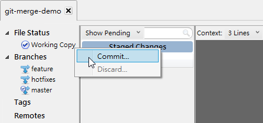

输入一些版本消息后，就可以执行 Commit 动作( Commit 按钮在视窗右下角 )：

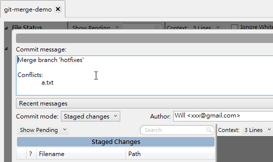

我们来看解决冲突并合并后的 commit graph 如下：

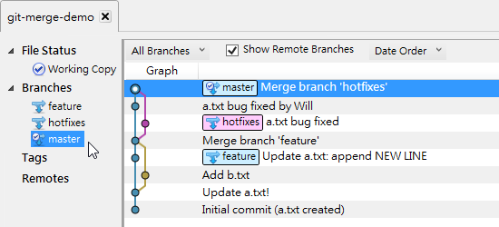

今日小结
-------

Git 合并算是比较困难的部分，但重点还是在观念，观念正确了，就算发生冲突也不用害怕。搭配好用的 GUI 工具，也能够更加顺利与快速的解决冲突问题。说真的，若发生冲突时没有 GUI 工具，光是打指令真的会疯掉。

我重新整理一下本日学到的 Git 指令与参数：

* git merge [other_branchname]
* git checkout -b [new_branchname]
* git reflog
* git branch -d [branchname]
* git branch -D [branchname]
* git branch feature <SHA1>
* git reset --hard ORIG_HEAD
* git status
* git ls-files -u
* git diff [filepath]

参考连结
-------

* [BRANCHING AND MERGING](http://gitref.org/branching/#merge)

-------
* [HOME](../README)
* [回目录](README)
* [前一天：善用版本日志 git reflog 追踪变更轨](16)
* <a href="18.md">下一天：修正 commit 过的版本历史记录 Part 1 (reset & amend)</a>

-------

