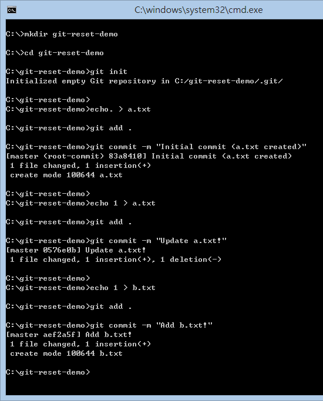
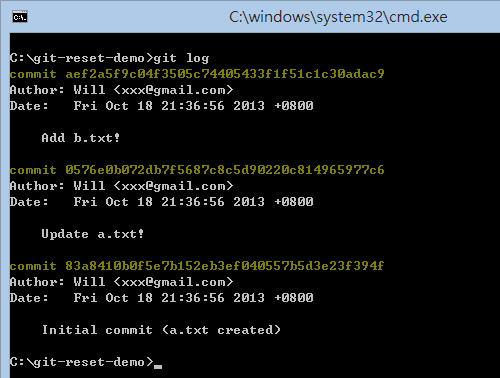
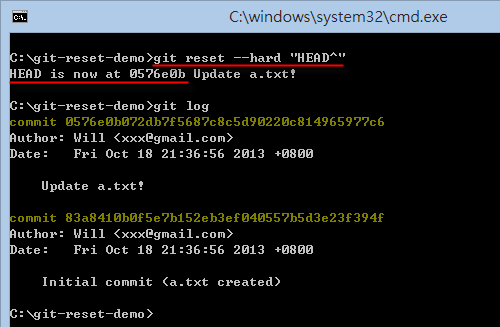
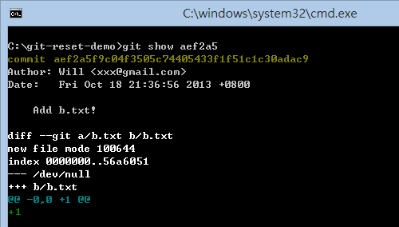
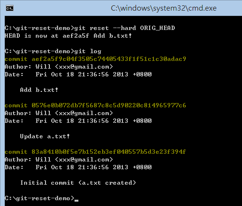
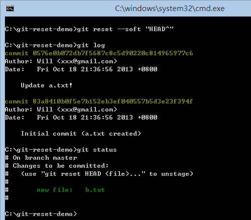
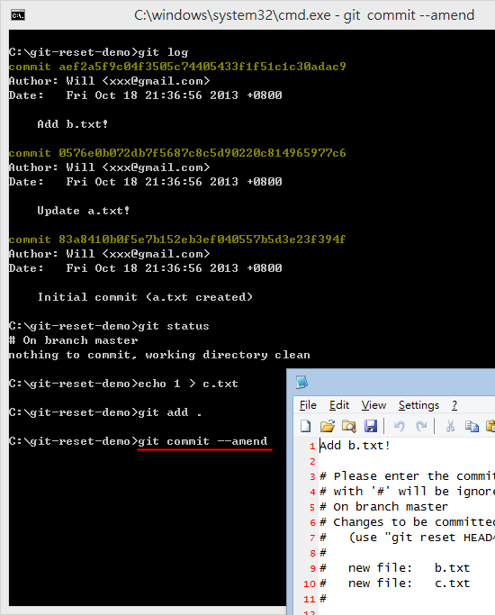
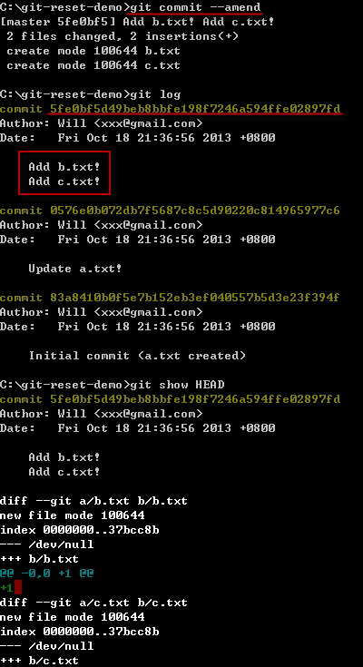

第 18 天：修正 commit 过的版本历史记录 Part 1
=============================================================

当你使用 Git 进行版本控制时，我们会利用 `git commit` 建立许多版本，由于 Git 属分布式版本控制机制，对于版本控制方面没有太多的权限设计，跟其他如 Subversion 或 TFVC 这类版控系统相比，Git 提供更多「修正版本记录」的机制，让你在「分享」版本给其他人的时候，能够预先做个整理。

版本控制的基本原则
-------------------

我们在进行版本控制时，无论是 Git, Subversion 或 TFVC 都一样，维持一个良好的版本记录有助于我们追踪每个版本的更新历程 (当有需要做这件事的时候)。以我个人的经验，我们很难有机会，也不太想去追踪我们某个项目中软件开发的进程，我们许多项目累积的版本记录数量有多达数千笔，谁会有这种闲工夫去追查历史呢？

然而实际上，当软件的臭虫(Bug)发生的时候，我们会需要去追踪特定臭虫的历史记录，以查出该臭虫真正发生的原因，这个时候就是版本控制带来最大价值的时候。

也因此，要怎样维持一个好的「版本记录」也是非常重要的，这边有一些控制原则可以分享给大家：

* 做一个小功能修改就建立版本，这样才容易追踪变更
* 千万不要累积一大堆修改后才建立一个「大版本」
* 有逻辑、有顺序的修正功能，确保相关的版本修正可以按顺序提交(commit)，这样才便于追踪

不过，人非圣贤、孰能无过，哪个人能确保团队所有人都能时时刻刻照着上述原则进行版控？哪个人不是「想到哪改到哪」呢？这样的要求变得有点緣木求魚、不切实际。所以，我们需要有一套「修改版本」的机制，让版本提交到远端服务器上的时候，就已经是完美的版本状态。

修正 commit 历史记录的理由
---------------------------

到目前为止，我还没提到关于「远端仓库」的细节，所以大部分的 Git 操作都还专注在本地端，也就是在工作目录下的版本管控，这个仓库就位于你的 `.git/` 目录下。然而，之后我们即将提到「远端仓库」的应用，到时就不只一个人拥有仓库，所需要注意的细节也就更多。

完全开放每个人都能够任意的修正 commit 历史记录，这个概念对于熟悉 Subversion 或 TFVC 的人来说或许听起来非常很奇怪，因为以往大家都集中连接到版本控制的服务器上，用的是集中式的仓库，如果有人可以任意窜改历史记录，那版控还叫做版控吗？

其实在 Git 版本控制中，概念是一样的，只要同一份仓库有多人共用的情況下，若有人任意窜改版本，那么 Git 版本控制一样会无法正常运作。

所以，到底什么样的使用情境会需要去修改版本记录呢？以下几点各位可以参考看看。

假设我们现在有 [A] -> [B] -> [C] 三个版本：

* 可能 [C] 版本你发现 commit 错了，必须删除这一版本所有变更
* 你可能 commit 了之后才发现 [C] 这个版本其实只有测试代码，你也想删除他
* 其中有些版本的记录消息有错字，你想修改消息文字，但不影响文件的变更历程
* 你可能想把这些版本的 commit 顺序调整为 [A] -> [C] -> [B]，让版本演进更有逻辑性
* 你发现 [B] 这个版本忘了加入一个重要的文件就 commit 了，你想事后補救这次变更
* 在你打算｢分享」分支出去时，发现了代码有瑕疵，你可以修改完后再分享出去

修正 commit 历史记录的注意事项
-----------------------------

Git 保留了「修改版本历史记录」的机制，主要是希望你能在「自我控制版本」到了一定程度后，自己整理一下版本记录的各种信息，好让你将版本「发布」出去后，让其他人能够更清楚的理解你对这些版本到底做了哪些修改。

所以，修改版本历史记录时，有些事情必须特别注意：

* 一个仓库可以有许多分支 (预设分支名称为 `master`)
* 分享 Git 原始码的最小单位是以「分支」为单位
* 你可以任意修改某个支线上的版本，只要你还没「分享」给其他人
* **当你「分享」特定分支给其他人之后，这些「已分享」的版本历史记录就別再改了！**

准备本日练习用的版本库
----------------------

之前我们曾在【第 04 天：常用的 Git 版本控制指令】学过 `git reset` 的用法，主要用来 **重置目前的工作目录**。不过，相同的指令，也可以用来修正版本历史记录。

在开始说明前，我们一样先用以下指令建立一个练习用的工作目录与本地仓库：

	mkdir git-reset-demo
	cd git-reset-demo
	git init

	echo. > a.txt
	git add .
	git commit -m "Initial commit (a.txt created)"

	echo 1 > a.txt
	git add .
	git commit -m "Update a.txt!"

	echo 1 > b.txt
	git add .
	git commit -m "Add b.txt!"

以上建立了三个版本，执行 `git log` 的结果如下图示：

删除最近一次的版本
-------------------

我们参考上图，用文字表达这三个版本的顺序如下：

	[83a841] > [0576e0] > [aef2a5]

现在，我想把最后一个版本删除，变成：

	[83a841] > [0576e0]

那么，你可以执行 `git reset --hard "HEAD^"` 即可删除 `HEAD` 这个版本：
**请注意**：在「命令提示字元下」 `^` 是特殊符号，所以必须用雙引号括起来！

此时你可以看见，原本的最新版被删除了，那是因为刚刚我们执行 `git reset --hard "HEAD^"` 这个动作，把 `HEAD` 指向的位址改到了前一个版本 ( `HEAD^` )，所以你打 `git log` 就看不到这个版本了。

事实上，原本你感觉被删除的版本，其实一直储存在 Git 的物件储存区(object storage)里，也就是这笔资料一直躺在 `.git\objects\` 目录下。我们还是可以用 `git show 83a841` 取得该版本 ( 即 commit 物件 ) 的详细资料：

删除最近一次的版本，但保留最后一次的变更
------------------------------------

还记得吗？无论你对 Git 仓库做了什么事，都是可以还原的，只要执行 `git reset --hard ORIG_HEAD` 即可。

另一个删除版本的技巧，则是「删除最近一次的版本记录，但留下最后一次版本变更的异动内容」，这时你可以执行 `git reset --soft "HEAD^"` 达成这个任务：

这代表着，你可以保留最后一次的变更，再加上一些变更后，重新执行 `git commit` 一次，并重新设定一个新的记录消息。

重新提交一次最后一个版本 (即 `HEAD` 版本)
-----------------------------------------

如果你发现不小心执行了 `git commit` 动作，但还有些文件忘了加进去 (`git add [filepath]`) 或只是记录消息写错，想重新補上的话，直接执行 `git commit --amend` 即可。这个动作，会把目前记录在索引中的变更文件，全部添加到当前最新版之中，并且要求你修改原本的记录消息。

我们再执行一次 `git reset --hard ORIG_HEAD` 复原到原本的状态。

底下我试着多新增一个 `c.txt` 文件上去，然后直接执行 `git commit --amend` 命令，这时会跳出指定的文字编辑器进行编辑，且预设会把目前这次的消息也给填上，你只要修改一下就可以了

我把记录消息修改成以下文字，并且存档后退出，版本就会建立完成：

	Add b.txt!
	Add c.txt!

执行的结果如下，但最值得注意的是，最新版的 `HEAD` 已经是完全不同的 commit 物件了，所以用 `git log` 所看到的 commit 物件绝对名称跟之前已经不一样了。

今日小结
-------

今天简单的学到如何对【最新版】(`HEAD`)进行版本的变更，大多用在不小心 `git commit` 错的情況，事实上还会有更多调整版本历史记录的方式，这些会在之后的文章中出现。

我重新整理一下本日学到的 Git 指令与参数：

* git reset --hard "HEAD^"
* git reset --soft "HEAD^"
* git reset --hard ORIG_HEAD
* git commit --amend

参考连结
-------

* [git-reset(1) Manual Page](https://www.kernel.org/pub/software/scm/git/docs/git-reset.html)

-------
* [回目录](README.md)
* [前一天：关于合并的基本观念与使用方式](17.md)
* [下一天：设定 .gitignore 忽略清单](19.md)

-------

