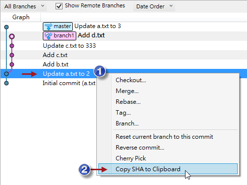
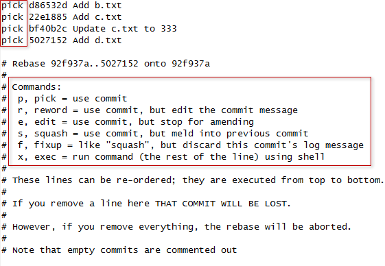
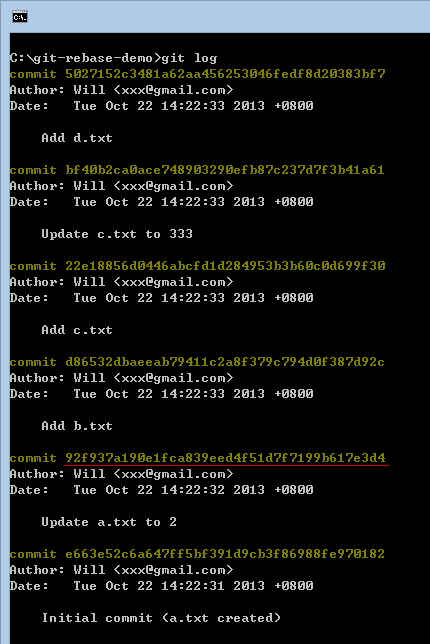
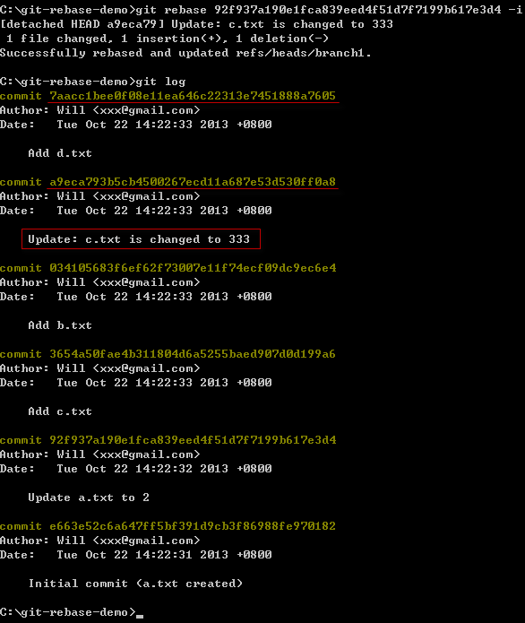
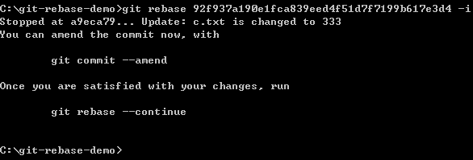
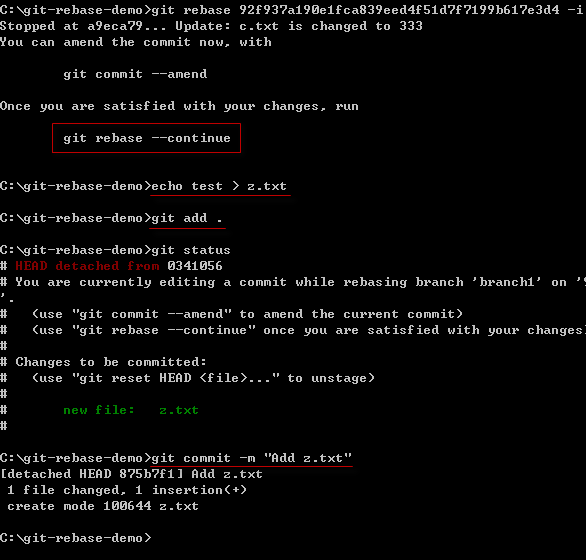

第 23 天：修正 commit 过的版本历史记录 Part 5
============================================================

我们上一篇文章谈到的 Rebase 是用来将现有的两个分支进行「重新指定基础版本」，执行 Rebase 之后，也会改掉原本分支的起点 (分支点移动了)，所以导致版本线图发生变化。不过 Rebase 可以做到的能力不只这样，他还能用来修改特定分支线上任何一个版本的版本信息。

准备本日练习用的版本库
-------------------------

我们一样先用以下指令建立一个练习用的工作目录与本地仓库 (一样先切换到 `C:\` 然后复制贴上就会自动建立完成)：

	mkdir git-rebase-demo

	cd git-rebase-demo
	git init

	echo 1 > a.txt
	git add .
	git commit -m "Initial commit (a.txt created)"

	ping 127.0.0.1 -n 2 >nul

	echo 2 > a.txt
	git add .
	git commit -m "Update a.txt to 2"

	ping 127.0.0.1 -n 2 >nul

	:: 建立并切换到 branch1 分支
	git checkout -b branch1

	echo b > b.txt
	git add .
	git commit -m "Add b.txt"

	echo c > c.txt
	git add .
	git commit -m "Add c.txt"

	echo 333 > c.txt
	git add .
	git commit -m "Update c.txt to 333"

	echo d > d.txt
	git add .
	git commit -m "Add d.txt"

	ping 127.0.0.1 -n 2 >nul

	:: 切换到 master 分支
	git checkout master

	echo 3 > a.txt
	git add .
	git commit -m "Update a.txt to 3"

**注**：上述指令中的 `ping  127.0.0.1 -n 2 >nul` 主要是用到了 [如何在批次档(Batch)中实现 sleep 命令让任务暂停执行 n 秒](http://blog.miniasp.com/post/2009/06/24/Sleep-command-in-Batch.aspx) 文章中提到的技巧。

我们用 SourceTree 查看仓库的 commit graph (版本线图) 如下：

使用 `git rebase` 命令的注意事项
---------------------------------

这件事还是必须重申一次！首先，你的「工作目录」必须是干净，工作目录下的「索引」不能有任何准备要 commit 的文件 (staged files) 在里面，否则指令将会无法执行。

再来，也是最重要的，如果你的分支是从远端仓库下载回来的，请**千万不要**通过 Rebase 修改版本历史记录，否则你将会无法将修改过后的版本送到远端仓库！

Rebase 能做的事
-----------------

上一篇文章讲的，你可以将某个分支当成自己目前分支的「基础版本」。除了这件事以外，你还可以用来修改某个分支中「特定一段」历程的记录，你可以做的事情包括：

1. 调换 commit 的顺序
2. 修改 commit 的消息
3. 插入一个 commit
4. 编辑一个 commit
5. 拆解一个 commit
6. 压缩一个 commit，且保留消息记录
7. 压缩一个 commit，但丟弃版本记录
8. 删除一个 commit

这八件事，可以完整看出 Rebase 修正历史版本记录的强大威力，接下来我们就逐一介绍如何好好利用 Rebase 帮我们修订版本。

1. 调换 commit 的顺序
-----------------------

首先，我们先切换到 `branch1` 分支 ( `git checkout branch1` )

到 SourceTree 查看版本线图，然后我们先决定这个分支中想要执行 Rebase 的起点 (不一定要是分支的起始点，任何一版都可以)，决定之后，直接在 SourceTree 复制该版本的**绝对名称**(也就是以 SHA1 哈希过的 Git 物件ID)。从下图你可以看到，我们先在该版本按下鼠标右键，然后再点选 **Copy SHA to Clipboard** 即可将 id 复制到剪贴簿中：

然后我们执行 `git rebase 92f937a190e1fca839eed4f51d7f7199b617e3d4 -i`
**注意**: 这里的 `92f937a190e1fca839eed4f51d7f7199b617e3d4` 跟你自己建立的可能不一样，请不要照抄。

接着会跳出编辑器，并且让你编辑一系列「指令」，如下图示：

你如果什么都不改，就是执行这一系列 `pick` 等动作，这里必须先让各位了解的是这些指令的格式，与他的顺利代表的意义。

我们先来看第一行，区分成三个栏位，分別以「空白字元」间隔，分別如下：

1. `pick` 代表的是「命令」，底下注解的部分有一系列「命令」的名称与简写，你写 `p` 与 `pick` 都是一样的意思。
2. `d86532d` 代表的是要使用的 commit 物件编号(绝对名称)。
3. 剩下的文字则是这个版本的记录消息摘要。

如果你有看过【**第 22 天：修正 commit 过的版本历史记录 Part 4**】这篇文章，你应该会知道执行 Rebase 的时候，会先将我们目前 `branch1` 分支的最新版本(head)倒带(rewind)到你这次指定的分支起点(rewinding head)，在这个例子里，我们指定的分支起点就是 `92f937a190e1fca839eed4f51d7f7199b617e3d4` 这个节点。

这时我们用 `git log` 查看一下目前的版本记录，我们指定的那个版本，并不在我们的 Rebase 指令清单中。该指令清单，由上至下分別是「最旧版」到「最新版」的顺序，跟我们用 `git log` 执行的显示顺序刚好相反：

我们再重看一次这几个版本如下：

	pick d86532d Add b.txt
	pick 22e1885 Add c.txt
	pick bf40b2c Update c.txt to 333
	pick 5027152 Add d.txt

这里的 `pick` 代表的功能是 `use commit`，也就是我们要用这个版本来 commit 新版本。也就是上一篇文章讲到的**重新套用**(replay)这个字，所以这几个指令，就是让你在分支「倒带」之后，重新用这几个版本套用一次版本变更，而且重新套用的过程会沿用当时版本的变更记录。

现在我们先来尝试「**调换 commit 的顺序**」这个命令。

若要完成「**调换 commit 的顺序**」的任务，你只要很简单的修改这份文字档，把版本的前后顺序对调即可，例如我们修改成：

	pick 22e1885 Add c.txt
	pick d86532d Add b.txt
	pick bf40b2c Update c.txt to 333
	pick 5027152 Add d.txt

然后存档退出，我们看看指令最后的执行结果为何，你可以发现，我们这两个版本真的顺序对调了：

这里有一点你必须特别注意，那就是从 `92f937a190e1fca839eed4f51d7f7199b617e3d4` 这个版本开始，所有后续版本的 commit 绝对名称全部都不一样了，这代表我们在 Rebase 的过程会重新建立许多新的 commit 物件。那么旧的物件到哪里去了呢？真相是，这些以前的版本全部都还在，只是你找不到罢了，全都躺在 Git 物件仓库中，只要你知道这些版本(也就是 commit 物件)的绝对名称，你就可以随时取出！(请回忆一下 `git reflog` 命令)

我们从 SourceTree 里面看一下版本线图，感觉上跟上面那张图好像差很多，但其实只有这两个版本调换而已，线图不太一样的原因是时间序改变了，我想这应该是 SourceTree 的显示逻辑跟时间序有关，才会让这线图变得跟之前差这么多，初学者可別弄乱了。

2. 修改 commit 的消息
-----------------------

修改曾经 commit 过的消息，只要稍加修改 Rebase 的命令即可，我们先看看目前的版本记录：

如果我们打算把下图标示红线的版本消息修改为 `Update: c.txt is changed to 333` 文字的话，我们先执行跟上个例子相同的指令：

	git rebase 92f937a190e1fca839eed4f51d7f7199b617e3d4 -i

然后会开启文字编辑器，此时的内容应该如下：

	pick 3654a50 Add c.txt
	pick 0341056 Add b.txt
	pick 6883d87 Update c.txt to 333
	pick 36ed38f Add d.txt

我们想修改 `6883d87` 这个版本的消息，只要把这一行前面的 `pick` 改成 `reword` 即可。修改完后的文字如下：

	pick 3654a50 Add c.txt
	pick 0341056 Add b.txt
	reword 6883d87 Update c.txt to 333
	pick 36ed38f Add d.txt

然后存档退出，接着 Git 会开始重新 `pick` 这些版本进行套用，但套用到 `reword` 这个命令时，会重新再开启一次文字编辑器，让你可以在此时变更版本消息文字，这时我们直接改成 `Update: c.txt is changed to 333` 文字后存档退出，接着就会直接套用完后续的版本。

我们最后再用 `git log` 查看版本记录，发现该版本的消息确实已经变更为我们修改的那段文字。而且该版本与后续的版本 commit 物件编号也会不一样，不一样代表这两个是新的 commit 物件。

3. 插入一个 commit
-----------------------

接着我们再执行一次 `git rebase 92f937a190e1fca839eed4f51d7f7199b617e3d4 -i` 指令，目前的 Rebase 指令如下：

	pick 3654a50 Add c.txt
	pick 0341056 Add b.txt
	pick a9eca79 Update: c.txt is changed to 333
	pick 7aacc1b Add d.txt

如果我们想在 `a9eca79` 版本之后「插入一个新版本」，只要在  `a9eca79` 这行前面的 `pick` 改成 `edit` 即可让 Rebase 在重新套用的过程中「暂停」在这个版本，然后让你可以对这个版本进行「编辑」动作：

	pick 3654a50 Add c.txt
	pick 0341056 Add b.txt
	edit a9eca79 Update: c.txt is changed to 333
	pick 7aacc1b Add d.txt

然后存档退出，接着 Git 会开始执行套用，等执行到 `a9eca79` 这个版本时，套用的动作会被中断，并提示你可以执行 `git commit --amend` 重新执行一次 commit 动作：

因为我们的目的是希望在 `a9eca79` 这个版本之后「插入」一个新版本，所以我们可以直接在这个阶段「建立新版本」！

例如我想新增一个版本是「新增一个 `z.txt` 文件」，我可以这么做：

我们执行 `git rebase --continue` 让 Rebase 指令继续完成。最终完成的画面如下图示：

最后我们用 `git log` 查看一下，确实我们刚刚建立的 `Add z.txt` 这个版本已经成功被建立！

4. 编辑一个 commit
-----------------------

编辑一个 commit 的动作，就如【插入一个 commit】的示范一样，你只要先把该版本修正为 `edit` 命令，就可以利用 `git commit --amend` 重新执行一次 commit 动作，就等同于编辑了某个版本的记录。

5. 拆解一个 commit
-----------------------

拆解一个 commit 记录，代表的是你想要把「某一个 commit 记录」变成两笔记录，其实这个动作跟【插入一个 commit】几乎是完全一样的。差別仅在于你只要把编辑中的那个版本，将某些文件从「索引」状态中移除，然后执行 `git commit --amend` 就可以建立一个新版。然后再执行 `git add .` 重新把这些文件加入，然后再执行 `git commit`，即可将原本一个版本的变更，变成两个版本。

6. 压缩一个 commit，且合并消息记录
----------------------------------

所谓的「压缩一个 commit 版本」，代表你这几个版本中，有个版本消息有点多余，而且觉得可以把这个版本的变更合并到「上一个版本」(parent commit)中，那么你可以修改 Rebase 指令，把 `pick` 修改为 `squash` 即可。

通过压缩的方式，被套用 `squash` 命令的版本，其「版本记录消息」会被自动加入到「上一个版本」的消息中。

7. 压缩一个 commit，但丟弃版本记录
----------------------------------

如果你只想合并两个版本的变更，但不需要合并记录消息的话，那么你可以修改 Rebase 指令，把 `pick` 修改为 `fixup` 即可。

8. 删除一个 commit
-----------------------

删除一个 commit 版本是最简单的，只要直接把要删除的这几行 `pick` 命令给移除即可。

今日小结
-------

看到这里，你应该能感受到 Rebase 的强大威力。通过 `git rebase` 可以有效帮你「重整版本」，不但让你的 Git 版本记录更加易懂，也更有逻辑。这样做的好处，在多人开发的 Git 项目中尤其明显，为了你的团队成员着想，各位不得不学啊！

我重新整理一下本日学到的 Git 指令与参数：

* git rebase -i [commit_id]
* git commit --amend

-------
* [HOME](../README.md)
* [回目录](README.md)
* <a href="22.md">前一天：修正 commit 过的版本历史记录 Part 4 (rebase)</a>
* [下一天：使用 GitHub 远端仓库 - 入门篇](24.md)

-------

