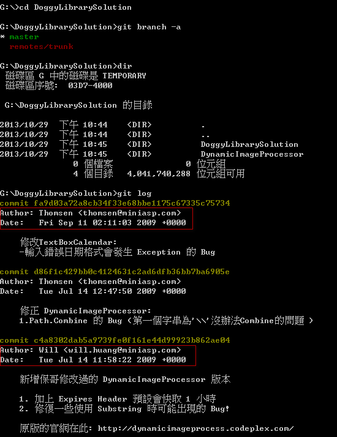
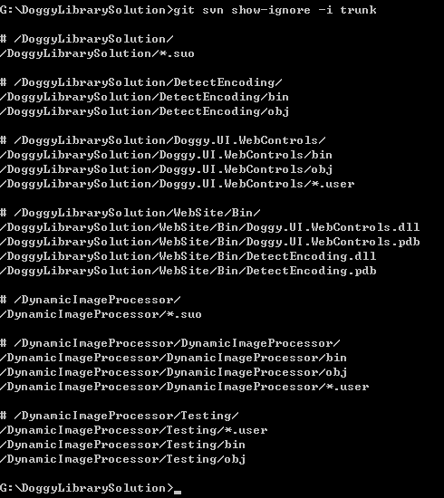
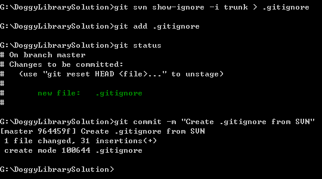

第 29 天：如何将 Subversion 项目汇入到 Git 仓库
==================================================================

当你越来越了解 Git 版本控制，一定会越来越想把手边的 Subversion ( 简称 SVN ) 项目改用 Git 进行版本控制。但碍于两者的版本架构差別什大，转换的过程稍微麻烦些，主要是要打些指令才行，还好 Git 已经内建了许多 SVN 的整合指令，让我们可以容易地将 SVN 项目转换过去。本篇文章将介绍如何用简单的四步骤，将现有的 SVN 项目转成 Git 仓库，并将转换后的本地仓库送上远端仓库。

准备使用者清单对应档
--------------------

我们先来看一个用 TortoiseSVN 的 Show log 看到的版本历史清单，在 **Author** 栏位看到的只有「使用者名称」而已：

不过，使用 Git 必须至少有「使用者名称」与「电子邮件地址」才能建立版本，所以我们必须先把 SVN 项目中所有的 **Author** 取出，并设定好一个对应档，才能完整的将 SVN 项目汇入到 Git 项目中。

我们假设 2 个变数：

* SVN 项目网址：`https://svnrepo:23443/svn/DoggyLibrarySolution`
* SVN 工作目录：`D:\Projects\DoggyLibrarySolution`
* GIT 安装路径：`C:\Program Files (x86)\Git`

**请注意**：执行 svn 命令必须事先安装 Subversion 指令列工具，下载连结: [Subversion Edge Download](http://www.collab.net/downloads/subversion)

我们开启「命令提示字元」并进入 SVN 工作目录，然后执行以下指令，你会得到一个 `SVNUsers.txt` 文件：

	SET PATH=%PATH%;C:\Program Files (x86)\Git\bin\
	svn log --quiet --xml | sed -n -e "s/<\/\?author>//g" -e "/[<>]/!p" | sort | sed "$!N; /^\(.*\)\n\1$/!P; D" > SVNUsers.txt

由于我们这个 SVN 项目只有 4 位开发人员，所以得到的 `SVNUsers.txt` 文件内容如下：

接下来，我要修改这个文件，在每一行后面加上 `=` 等号，再加上「使用者名称」与「电子邮件地址」，格式如下：

	svnuser = GitUsername <GitEmail>

修改完后的内容如下：

将 SVN 项目取出并转换成 Git 工作目录
-------------------------------------

假设我想将 GIT 工作目录设定在 `G:\DoggyLibrarySolution` 资料夹，那么你可以先把修改后的 `SVNUsers.txt` 文件复制到 `G:\` 目录下，然后执行以下指令：

	git svn clone https://svnrepo:23443/svn/DoggyLibrarySolution --no-metadata -A SVNUsers.txt --stdlayout

如果你可以存取的 SVN 仓库权限只有 /trunk 而已的话，你不能使用 --stdlayout 属性，例如：

	git svn clone https://svnrepo:23443/svn/DoggyLibrarySolution/trunk --no-metadata -A SVNUsers.txt

这个指令执行时，可能会需要你输入 SVN 版本库的登入账号密码。

转换后的结果来看，你会发现转换后的 Git 仓库，版本信息非常完整，他会保留 SVN 当初留下的 commit 时间与作者信息，这里的作者信息所显示的使用者名称与电子邮件地址则是我们刚刚定义档所设定的那些对应信息：

转换 SVN 的忽略清单 (即 `svn:ignore` 属性)
-------------------------------------------

SVN 项目中有所谓的 `svn:ignore` 属性，这等同于 Git 的 `.gitignore` 忽略清单。但是 SVN 的忽略清单散落在每个目录属性中，还好你可以通过 `git svn show-ignore` 指令转换这些信息为 Git 的格式。

接着我们直接通过以下指令取得 `.gitignore` 忽略清单档的内容：

	git svn show-ignore

不过你可能会遇到以下错误：

	G:\DoggyLibrarySolution>git svn show-ignore
	config --get svn-remote.svn.fetch :refs/remotes/git-svn$: command returned error: 1

如果遇到这个错误，代表 `git svn show-ignore` 找不到你的 SVN 路径，这通常发生在你的 SVN 版本库使用了标准的 trunk, branches, tags 资料结构，这时你可以改输入以下指令：

	git svn show-ignore -i trunk

接着我们建立一个 `.gitignore` 忽略清单档，并建立一个新版本，指令如下：

	git svn show-ignore -i trunk > .gitignore
	git add .gitignore
	git commit -m "Create .gitignore from SVN"

将项目推送到远端仓库
------------------------

由于 GitHub 在预设的情況下，只能建立「开源码」的 Git 项目，所以我们这次改用 [Bitbucket](https://bitbucket.org/) 网站来建立一个私有的 Git 项目 (Private Repository)。

建立完成后，按下 **Clone** 去复制 Git 仓库网址：

接着就跟我们之前学到的一样，把现有的项目给推送上去，如下指令：

	git remote add origin git@bitbucket.org:myaccount/doggylibrarysolution.git
	git push origin master

今日小结
-------

就这样简单四步骤，就可以把 SVN 项目完整的转移到 Git 仓库，是不是非常简单呢。

事实上，这个工作目录还可以持续地跟原本的 SVN 版本库溝通，可以 commit 变更，也可以 pull 变更回来 ( `git svn rebase` )，详细的操作说明只要执行 `git help svn` 就可以取得完整说明。当然，我还是建议转过去就转过去了，否则在 Git 环境下操作 SVN 总觉得怪怪的，有点多此一举的感觉，但确实有可能有这种需求。

-------
* [HOME](../README.md)
* [回目录](README.md)
* [前一天：了解 GitHub 上 forks 与 pull request 的版控流程](28.md)
* [下一天：分享工作中几个好用的 Git 操作技巧](30.md)

-------

