第 30 天：分享工作中几个好用的 Git 操作技巧
========================================================

终于来到了最后一天，这篇文章将分享几个好用的 Git 操作技巧，或许可以节省你不少 Git 版控过程的时间。

如何让 git pull / push / fetch 不用输入账号、密码
--------------------------------------------------

我们在使用 GitHub 的时候，由于预设使用 **HTTPS** 通讯协定取得 Git 仓库，例如：`https://github.com/doggy8088/frontend-tools.git`。但事实上你可以改用 **SSH** 选择当成取得 Git 远端仓库的网址，如下图示：

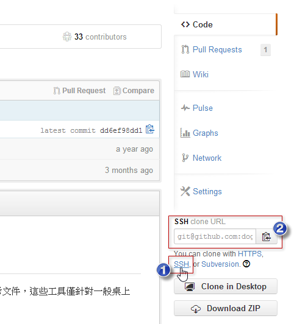

使用 HTTPS 通讯协定来存取 GitHub 上的远端仓库，由于无法记忆账号密码，所以每次执行远端仓库的指令一定都会被要求输入账号、密码。但改用 SSH 的话，就可以通过预先定义好的金钥来进行身分验证。

在第一次使用 GitHub for Windows 工具的时候，如果你有照着步骤登入与设定，这套工具会预设帮你产生一对金钥，然后该工具会自动上传到 GitHub 的 **SSH Key** 专区，让你日后不用再输入账号密码，就能顺利的操作 GitHub 上的远端仓库。

这一对金钥，预设就放在 `%USERPROFILE%\.ssh` 资料夹下，如果你的 Windows 登入使用者名称为 `Will` 的话，这个路径就位于 `C:\Users\Will\.ssh` 目录下。这对金钥的档名分別是 `github_rsa` (私钥) 与 `github_rsa.pub` (公钥)，如下图示：

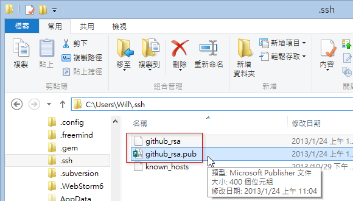

也因为这一对金钥的存在，所以你在 **Git Shell** 底下操作 Git 指令，所有针对远端仓库上的操作，都不需要再次输入账号密码。

事实上，不用输入密码的原因是「**GitHub for Windows 工具已经把 SSH 金钥上传到 GitHub 网站了**」，设定的网址在 `https://github.com/settings/ssh`，我们可以从以下图示看出设定的位址：

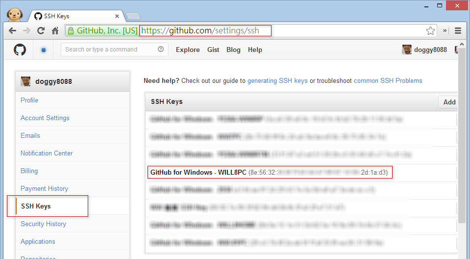

不过，如果你希望在「命令提示字元」（非 Windows Powershell 执行环境）下也可以不用输入账号密码验证，那么你可以尝试将 `%USERPROFILE%\.ssh` 资料夹下的两个文件分別把 `github_rsa` 复制一份改名成 `id_rsa`，然后把 `github_rsa.pub` 复制一份改名成 `id_rsa.pub`，即可完成设定！完成后如下图示：

这样就可以大功告成。

不过，如果你之前从 GitHub 复制回来的版本库是用 HTTPS 通讯协定的话，那么你还必须将这个远端 URL 修改成 ssh 的格式。例如我们现有的　remote URL 如下：

	G:\demo\frontend-tools>git remote -v
	origin  https://github.com/doggy8088/frontend-tools.git (fetch)
	origin  https://github.com/doggy8088/frontend-tools.git (push)

我们可以用 `git remote set-url origin git@github.com:doggy8088/frontend-tools.git` 来将现有的远端 URL 改成 SSH 的通讯协定，请看一下执行过程：

	G:\demo\frontend-tools>git remote -v
	origin  https://github.com/doggy8088/frontend-tools.git (fetch)
	origin  https://github.com/doggy8088/frontend-tools.git (push)

	G:\demo\frontend-tools>git push
	Username for 'https://github.com': fatal: could not read Username for 'https://github.com': No such file or directory
	^C
	G:\demo\frontend-tools>git remote set-url origin git@github.com:doggy8088/frontend-tools.git

	G:\demo\frontend-tools>git remote -v
	origin  git@github.com:doggy8088/frontend-tools.git (fetch)
	origin  git@github.com:doggy8088/frontend-tools.git (push)

	G:\demo\frontend-tools>git push
	Everything up-to-date

	G:\demo\frontend-tools>

如此一来，就可以不再需要验证账号密码了。

如何让操作 Bitbucket 远端仓库时，也可以不用输入账号、密码
----------------------------------------------------------

由于 GitHub for Windows 帮我们建立好一个现成的金钥，如果你要直接沿用，可以通过以下步骤产生 GitHub 与 Bitbucket 都能支持的 SSH 金钥格式：

1. 如果你有安装　SourceTree 的话，将会在以下路径找到 `puttygen.exe` 工具，并请直接开启程序：

	路径：`C:\Program Files (x86)\Atlassian\SourceTree\tools\putty`

	

	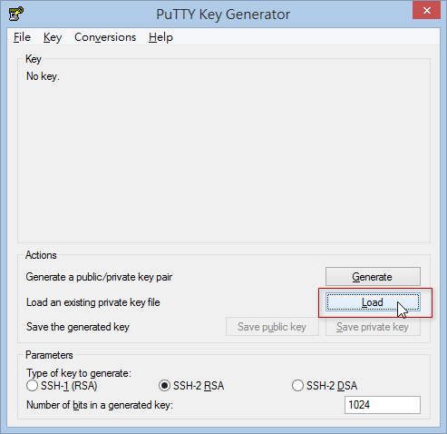

2. 接着载入 `%USERPROFILE%\.ssh\github_rsa` 私密金钥文件，并复制产生后的一串乱码，这就是 SSH 金钥中的公钥：

	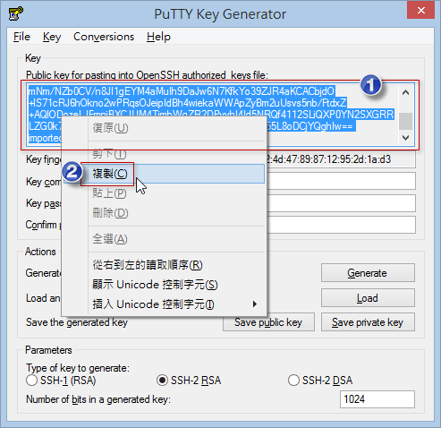

	※ 不过，如果你已经有 `github_rsa.pub` 这个文件的话，直接用 Notepad 开启这个文件，也可以直接拿来当成公钥的内容。

	这个 SSH 公钥的内容格式大致如下：

		ssh-rsa AAAAB3NzaC1yc2EAAAABIwAAACEAxtaDp6VqaKlm2b2EMJFL99T0ApR053qY2n7on8k+prv9ImajkjlVFqlLCu89JJYgz7/VehXxIYo11e45iIHUC8zkgtzomjuUPVFIGLCkKP/k8WbmNA/NZb0CV/n8JI1gEYM4aMuIh9DaJw6N7KfkYo39ZJR4aKmACbjdO+ls71cRJ6hOkBo2wPRqsOJeipIdEh4wiekaWWApZyBm2uUsvs5nb/FtdxZ+AQlODozeLJFmnjBXCJUM4TimbWgZR2tPyvhI4Id5NRQf4112SLiQXP0YN2SXGRRLZG0x7LBLk6FzmdUQBxEzayK7t6SBmsHyRvMOOADt55L8oDCjYzghIw== imported-openssh-key

3. 接着进入 Bitbucket 首页，并找到 SSH Key 页面，并按下 **Add Key** 以新增金钥：

	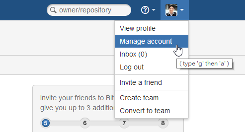

	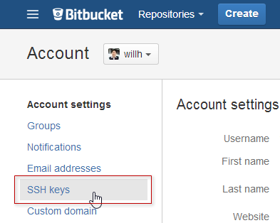

	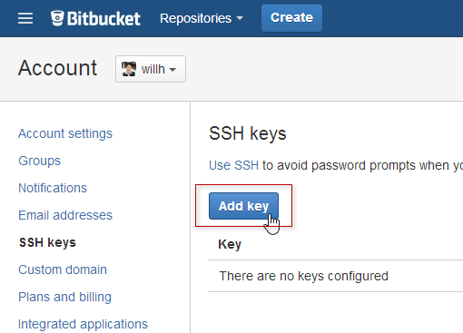

4. 输入一个好记名称与公钥内容后，就大功告成，从今以后连接 Bitbucket 也不用再输入账号、密码了。

	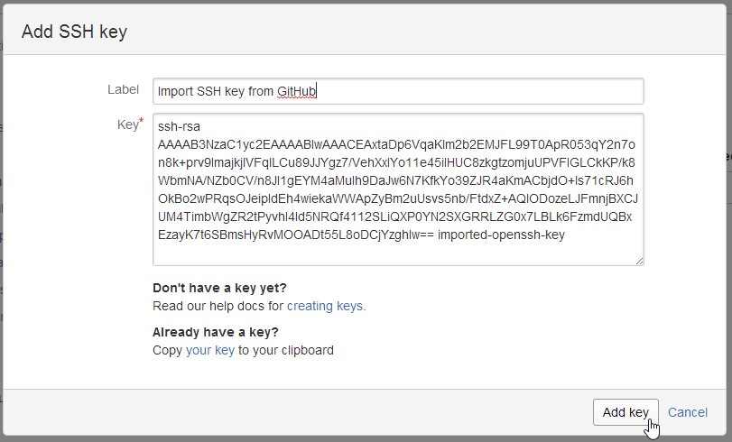

	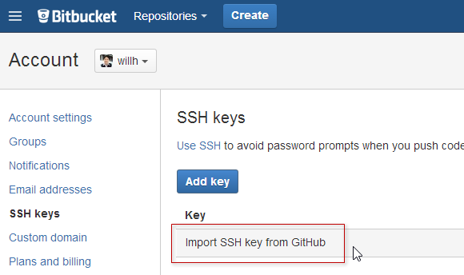

如何还原一个 `git rebase` 变动
-------------------------------

如果单纯地用 `git merge` 合并一个文件，要还原合并很简单，直接打 `git reset --hard ORIG_HEAD` 即可还原本次合并的变更。但是 `git rebase` 怎么办？因为 `git rebase` 会将版本线图改变，而且分支的结构也会发生变化，感觉上好像很难做还原动作，但其实非常简单。

我用一张图来解释还原的过程：

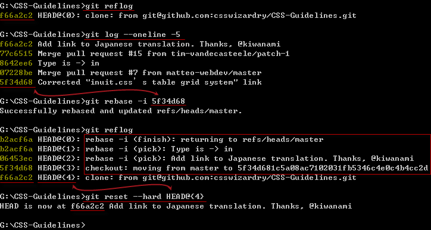

1. 先知道你在 Rebase 之前，是落于哪个版本。
2. 再查出你要从哪个版本开始 Rebase
3. 然后真正执行 Rebase 动作
4. 不管做了哪些动作，你再执行一次 `git reflog` 就可以看出 Rebase 真正做了几件事
5. 若要还原 Rebase 的版本，只要找到 Rebase 之前的版本，就可以通过　`git reset --hard` 来还原

取得远端仓库的统计信息
-------------------------

由于我们通过 `git clone` 的时候，就可以抓回完整的版本记录，这代表我们可以随时在本地仓库统计版本信息。

例如我们想取得版本库中所有人的 commit 次数统计，可以输入　`git shortlog -sne` 即可详细列出每个人的 commit 次数，而且加上 `-n` 参数还可以按照 commit 数量进行降幂排序：

	G:\CSS-Guidelines>git shortlog -sne
	    58  Harry Roberts <harry@csswizardry.com>
	     2  Matteo Nicoletti <matteo.nicoletti@webdev.it>
	     1  Mike <mike@mikepennisi.com>
	     1  Tim Vandecasteele <tim.vandecasteele@gmail.com>

也可以利用 `git shortlog` 显示出每个人最近 commit 过的历史记录。

	G:\CSS-Guidelines>git shortlog
	Harry Roberts (58):
	      Iitial commit
	      Adding readme and other guideline text
	      Update URL to BSkyB
	      Fix typo in README
	      Update doc URL
	      Update README intro
	      Update README intro
	      Embolden sharing details
	      Update copyright date
	      Add closing sentence to preprocessor section.
	      Tidy up link to CSS perf article.
	      Correct syntax for conditional comment.
	      Fix typo
	      Add note about syntax rules.
	      Use more robust URL in tweet link.
	      Use more robust URL in tweet link
	      Use more robust URL in tweet link
	      Merge pull request #3 from jugglinmike/typo
	      Add section on key selectors
	      Add section on key selectors
	      Remove Twitter link
	      Reformat and add BEM section
	      Complete rewrite
	      Rename file
	      Add table of contents
	      Add note about spaces and multiline
	      Reword of quasi-qualified selectors
	      Reword ruleset anatomy section
	      Fix typo in naming conventions
	      Clarify BEM meaning
	      Fix typo in comments section
	      Clarify quasi-qualifiying
	      Intro to second section
	      Reword new componnets section
	      Add JS naming section
	      Add JS hooks to ToC
	      Clear up JS hooks class definition
	      Reword source order section
	      Update link to inuit.css tables grid
	      Add classes in HTML section
	      Remove Sky disclaimer
	      Personalise tone of voice
	      Add section on internationalisation
	      Add link to Russian translation by @matmuchrapna
	      Remove unnecessary word
	      Slight reword
	      Completely reverse stance on internationalisation
	      Merge branch 'master' of github.com:csswizardry/CSS-Guidelines
	      Fix typo (thanks @stanton)
	      Fix typo (thanks @stanton)
	      Add Chinese translation
	      Add link to French translation
	      Merge pull request #7 from matteo-webdev/master
	      Merge pull request #15 from tim-vandecasteele/patch-1
	      Add link to Japanese translation. Thanks, @kiwanami

	Matteo Nicoletti (2):
	      Removed trailing spaces
	      Corrected "inuit.css’s table grid system" link

	Mike (1):
	      Insert omitted word

	Tim Vandecasteele (1):
	      Type is -> in

你也可以利用 GitHub 上 **Graph** 页面提供的统计信息：

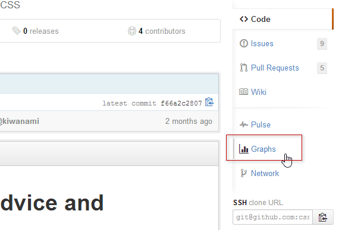

这里主要提供六种报表：

* Contributors (本项目贡献者的活跃程度）
* Commit Activity (每一天的 commit 活动数量)
* Code Frequency (原始码异动服务，可看出每天新增与删除的代码行数)
* Punchcard (每一天的 commit 数量，用打卡的方式来显示) (类似上下班打卡的那种卡片)
* Network (pull request 与 merge 的图形表示)
* Members (所有 fork 此项目的 github 成员)

点进去之后，还可以继续往下钻(Drill-Down)，查看更细的统计报表：

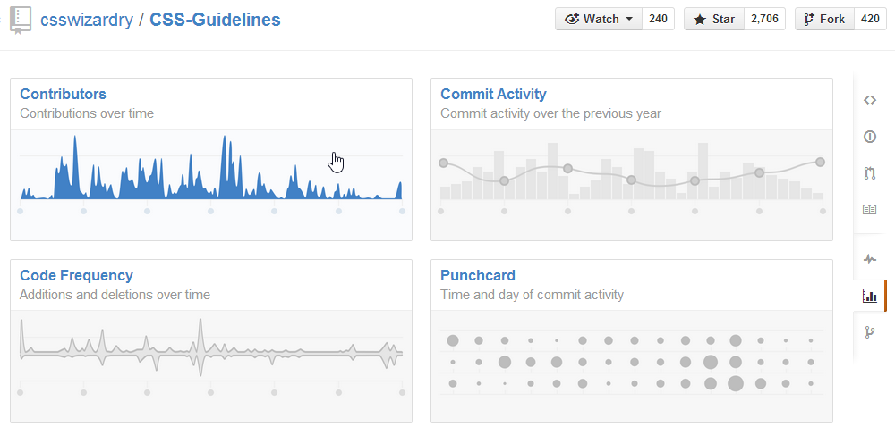

从工作目录清除不在版本库中的文件
----------------------------------

我们在 Git 工作目录中，通常会产生一些不必要的文件，而这些文件通常都会通过 `.gitignore` 文件，让 Git 自动忽略这些文件。如果你今天想要把这些额外的文件都给删除掉，可以通过 `git clean -f` 强迫删除这些文件。

不过，执行之前，还是建议用 `git clean -n` 看一下，这个指令会列出他「预计」会删除那些文件，等你确认过后在执行 `git clean -f` 删除即可文件。

删除远端分支
-------------

如果你将「本地分支」通过 `git push origin FixForCRLF` 指令建立起「远端分支」，也代表在远端会被建立一个名为 `FixForCRLF` 的分支，如果你想在本地下指令删除远端追踪分支，可以输入以下指令 (在远端分支前面加上个 `:` 而已)：

	git push origin :FixForCRLF

另一个同样目的的指令用法如下，指令看起来较为直觉些：

	git push origin --delete FixForCRLF

※ 不过使用时要注意，如果有人下载过这个远端分支的话，他就再也无法通过 `git push` 把变更推送上来了。

找出改坏程序的凶手
--------------------

替原始码做版控，最有效的就是每个文件的每一行都可以进行详细追踪，今天如果程序发生异常，且找到哪一行出错时，就可以通过 `git blame` 指令，帮你找出真正改坏程序的凶手，并且去看他为什么会改坏。

用法如下：

	git blame [filename]

	git blame -L [开始行数],[结束行数] [filename]

例如：

	git blame README.md

	git blame -L 8,16 ViewModels/MemberViewModel.cs

	git blame -L 4, Models/Product.cs

今日小结
----------

一些小技巧，需要的时候就会用的到。

铁人赛完结感言
--------------

短短 30 天，说长不长、说短不短，但我为了写这个系列文章，还真的是累翻了。刚我把我的文章原稿放进 Word 统计，这才惊觉我写了十几万字 (不含代码)，这真是太神奇了，杰克！

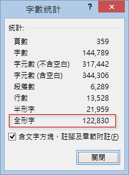

如同我之前讲过的，虽然市面上 Git 的 GUI 工具好几套，但想要有效率且正确的使用这些 Git 工具，先建立起完整的 Git 基本观念非常重要，否则只会一直鬼打墙而已。

Git 博大精深，短短 30 天着实无法完整交代所有细节，但工作上会用到的观念与工具都讲到，如果认真看的话，相信对大家在工作上会有帮助。

-------
* [HOME](../README.md)
* [回目录](README.md)
* [前一天：如何将 Subversion 项目汇入到 Git 仓库](29.md)

-------

