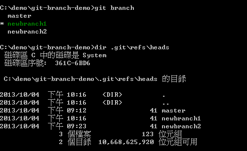
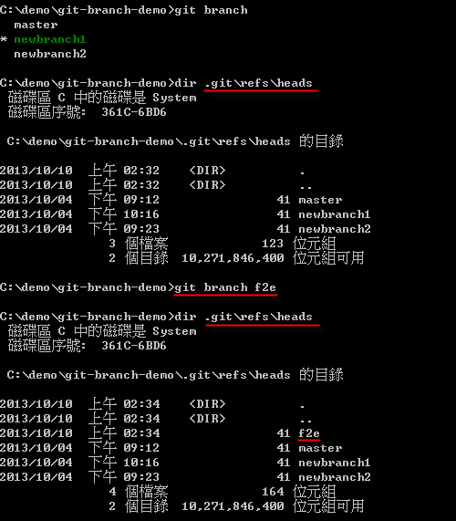
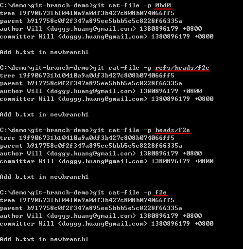
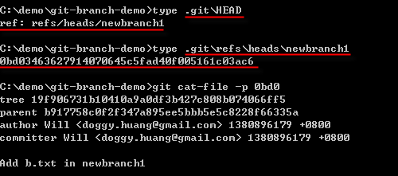
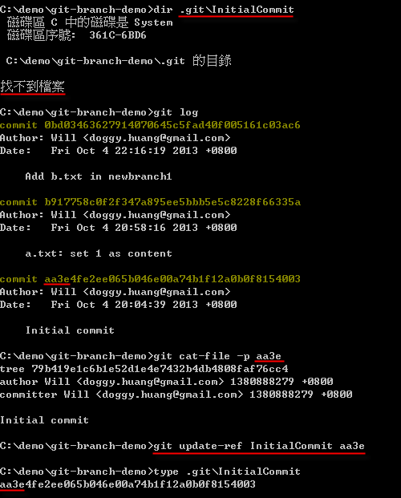
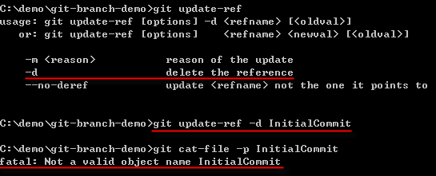
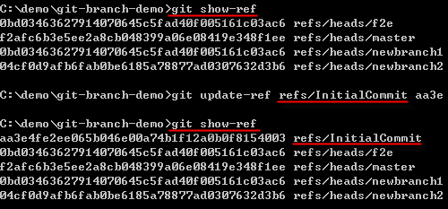
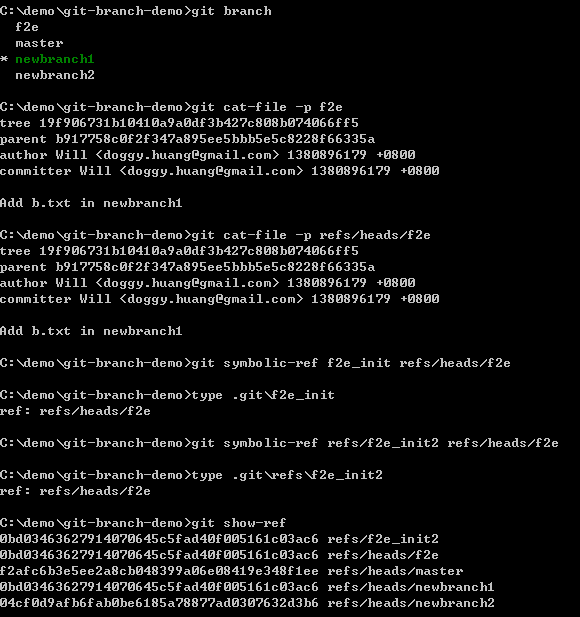

第 11 天：認識 Git 物件的一般參照與符號參照
==========================================================

在認識了 Git 物件的「絕對名稱」後，接下來就要介紹 Git 版控過程中最常用到的「參照名稱」。

認識物件的參照名稱
------------------

參照名稱 (ref) 簡單來說就是 Git 物件的一個「指標」，或是相對於「絕對名稱」的另一個「好記名稱」，用一個預先定義或你自行定義的名稱來代表某一個 Git 物件。

在我們之前學到的｢分支名稱｣或我們曾經用過的 HEAD (代表最新版本)，或是我們之後會學到的「標籤名稱」，這些都是「參照名稱」，總之就是為了讓你好記而已。

我們以｢分支名稱｣為例，來說明一下「參照名稱」的實體結構為何。以下圖為例，我們透過 `git branch` 取得所有分支名稱，你可以看到我們目前有三個分支，然而這三個分支的名稱其實就是一個｢參照名稱｣，這代表這三個「參照名稱」分別對應到 Git 物件儲存庫中的三個 commit 物件。在下圖中你也可以看出這些分支的參照名稱其實就是一個檔案而已，所有「本地分支」的參照名稱皆位於 `.git\refs\heads` 目錄下：

接著我再以下圖來證明這個檔案是如何跟「絕對名稱」做連結。我先透過 `git branch` 取得所有分支名稱，並發現目前「工作目錄」是指向 `newbranch1` 這個分支。此時我們透過 `git log --pretty=oneline` 即可取得該分支的所有版本紀錄。預設這些分支的「參照名稱」會指向分支的「最新版」，我們只要打開 `.git\refs\heads\newbranch1` 檔案的內容，就可以看出這是一個純文字檔而已，而且是指向版本歷史紀錄中的「最新版」。最後再以 `git cat-file -p 0bd0` 取得該 commit 物件的內容，以及用 `git show 0bd0` 取得該版本的變更紀錄，藉此證明這些檔案就是「參照名稱」的主要用途。

我們再透過指令看看使用「絕對名稱」與「參照名稱」讀取特定 commit 物件的內容，證明這兩個指令執行的結果是相同的：

在大多數的情況下，「參照名稱」通常都會指向一個 commit 物件，但並非必要，你也可以指向其他 Git 物件類型，像是 blob 物件、tree 物件、tag 物件等等。

關於 .git/refs/ 目錄
---------------------

從上述範例其實已經能看出，所有的「參照名稱」都是個檔案，而且一律放在 `git/refs/` 目錄下。而 Git 的參照名稱所放置的目錄位置，主要有三個：

* 本地分支：`.git/refs/heads/`
* 遠端分支：`.git/refs/remotes/`
* 標　　籤：`.git/refs/tags/`

再舉個簡單例子，如果你建立一個分支名稱為 `f2e`，這時你會知道本地分支的「參照名稱」會建立 `.git/refs/heads/f2e` 檔案，如下圖示：

事實上，這個 `f2e` 的「全名」應該叫做 `refs/heads/f2e` 才對，只是 Git 允許你輸入簡寫，方便你快速輸入參照名稱而已。如下圖示，這三種使用「參照名稱」的方式都是可行的：

不過當你輸入參照名稱的「簡稱」時，預設 Git 會依照以下順序搜尋適當的參照名稱，只要找到對應的檔案，就會立刻回傳該檔案內容的「物件絕對名稱」：

* `.git/<參照簡稱>`
* `.git/refs/<參照簡稱>`
* `.git/refs/tags/<參照簡稱;標籤名稱>`
* `.git/refs/heads/<參照簡稱;本地分支名稱>`
* `.git/refs/remotes/<參照簡稱>`
* `.git/refs/remotes/<參照簡稱;遠端分支名稱>/HEAD`

例如，當你輸入 `git cat-file -p f2e` 指令的話，那麼 Git 就會用以下順序找到相對的「參照名稱檔」，取出該檔案的內容 (即 Git 物件的絕對名稱)：

* `.git/f2e` --> 找不到此檔案
* `.git/refs/f2e` --> 找不到此檔案
* `.git/refs/tags/f2e` --> 找不到此檔案
* `.git/refs/heads/f2e` --> **找到了參照名稱，以下就不繼續搜尋**
* `.git/refs/remotes/f2e`
* `.git/refs/remotes/f2e/HEAD`

認識物件的符號參照名稱 (symref)
-----------------------------

符號參照名稱 (symref) 其實也是參照名稱 (ref) 的一種，只是內容不同而已。我們從下圖應可看出其內容的差異，「符號參照」會指向另一個「參照名稱」，並且內容以 `ref:` 開頭：

在 Git 工具中，預設會維護一些特別的符號參照，方便我們快速取得常用的 commit 物件，且這些物件預設都會儲存在 `.git/` 目錄下。這些符號參考有以下四個：

* HEAD
	* 永遠會指向「工作目錄」中所設定的「分支」當中的「最新版」。
	* 所以當你在這個分支執行 `git commit` 後，這個 `HEAD` 符號參照也會更新成該分支最新版的那個 commit 物件。
* ORIG_HEAD
	* 簡單來說就是 HEAD 這個 commit 物件的「前一版」，經常用來復原上一次的版本變更。
* FETCH_HEAD
	* 使用遠端儲存庫時，可能會使用 `git fetch` 指令取回所有遠端儲存庫的物件。這個 FETCH_HEAD 符號參考則會記錄遠端儲存庫中每個分支的 HEAD (最新版) 的「絕對名稱」。
* MERGE_HEAD
	* 當你執行合併工作時 (關於合併的議題會在日後的文章中會提到)，「合併來源｣的 commit 物件絕對名稱會被記錄在 MERGE_HEAD 這個符號參照中。

一般參照與符號參照的使用方式
---------------------------

我們知道「參照名稱」有特殊的目的，通常用於「本地分支」、「遠端分支」與「標籤」等情境下，但事實上你可以建立任意數量的「自訂參照名稱」，只要透過 `git update-ref` 就可以自由建立「一般參照」。

我企圖建立一個名為 `InitialCommit` 的一般參照，並指向 Git 儲存庫中的第一個版本，請參見如下圖的指令執行順序，得知一般參照的建立方式：

建立完成後，預設檔案會放在 `.git` 資料夾下，且此時用「絕對名稱」與「參照名稱」都能存取特定 Git 物件的內容：

**註**：請記得，參照名稱可以指向任意 Git 物件，並沒有限定非要 commit 物件不可。

若要建立較為正式的參照名稱，最好加上 `refs/` 開頭，例如：`git update-ref refs/InitialCommit [object_id]`。

若要刪除一般參照，則可以使用 `-d` 選項。如下圖示：

顯示所有參照的方式，則可以使用 `git show-ref` 指令，如下圖示：

若要建立與刪除「符號參照」，可以參考如下圖 `git symbolic-ref` 的用法。請自行看圖說故事，理解之後，你真的會發現 Git 對於參照的用法非常靈活且強大。還有，執行 `git show-ref` 只會顯示在 `.git\refs` 目錄下的那些參照，而且不管是「一般參照」或「符號參照」都一樣：

本文稍早提到你可以建立參照到以下目錄：

* `.git/<參照簡稱>`
* `.git/refs/<參照簡稱>`
* `.git/refs/tags/<參照簡稱;標籤名稱>`
* `.git/refs/heads/<參照簡稱;本地分支名稱>`
* `.git/refs/remotes/<參照簡稱>`
* `.git/refs/remotes/<參照簡稱;遠端分支名稱>/HEAD`

自訂參照通常會自行建立在前兩個路徑下，以免分不清跟我們使用「本地分支」、「遠端分支」與「標籤」的使用方式。不過，你的確可以利用 `git update-ref` 建立任何自訂參照，若把自訂參照建立在 `refs/heads/Will` 的話，也等同於建立了一個名為 `Will` 的分支，而 Git 真的就是這麼單純，當你越來越了解 Git 的內部結構，也會更加喜歡上 Git 的各種特性。

今日小結
-------

我們知道「參照名稱 (ref)」 簡單來說就是 Git 物件的一個「指標」，用來指向特定 Git 物件，所以你可以把「參照名稱」想像成 Git 物件絕對名稱的別名 (Alias)，用來幫助記憶。在 Git 裡，有許多機制可以幫你控管專案，例如「分支」、「標籤」等等，這些機制骨子裡其實就是靠「參照」完成的。

Git 參照名稱又有區分「一般參照」與「符號參照」，兩者的用途一模一樣，只在於內容不太一樣。「符號參照」會指向另一個「一般參照」，而「一般參照」則是指向一個 Git 物件的「絕對名稱」。

我重新整理一下本日學到的 Git 指令與參數：

* git branch
* git log --pretty=oneline
* git log --oneline
* git cat-file -p [ref or object_id]
* git show [ref or object_id]
* git update-ref
* git symbolic-ref
* git show-ref

-------
* [HOME](../README)
* [回目錄](README)
* [前一天：認識 Git 物件的絕對名稱](10)
* [下一天：認識 Git 物件的相對名稱](12)

-------

